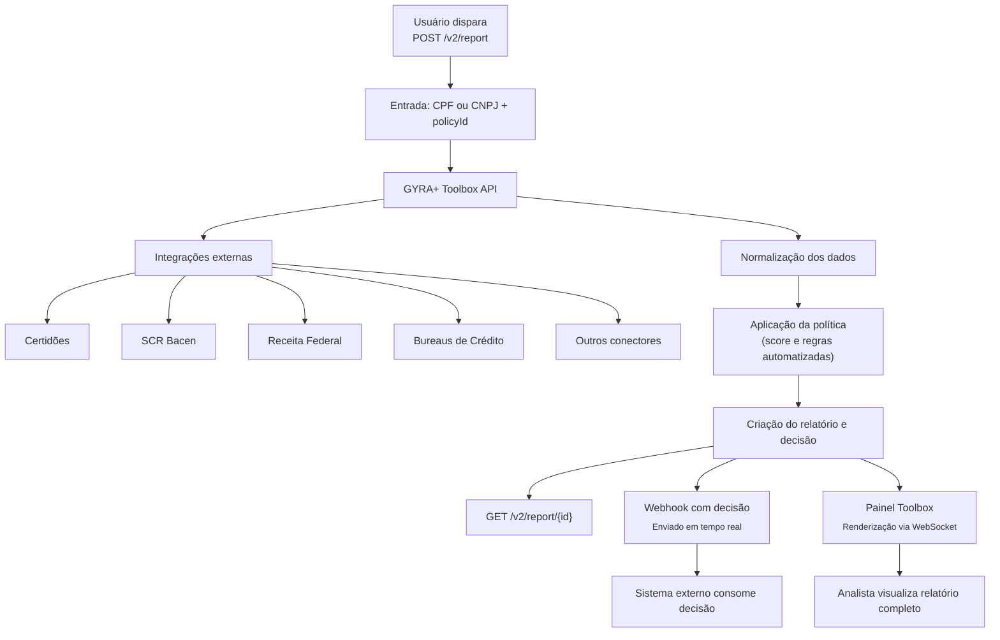

A API da GYRA+ foi construída para entregar **respostas em tempo real** com alto nível de personalização por cliente e por tipo de política.

O fluxo padrão é simples:

## Eventos em tempo real

Após o envio do documento via `POST /v2/report`, o relatório é processado de forma assíncrona. O resultado pode ser consultado de duas maneiras:

- 🔔 **Webhook:** se configurado, a GYRA+ enviará um POST para o seu endpoint com o status atualizado.
- 📡 **Toolbox:** se você estiver logado no painel, o status do relatório aparece automaticamente via WebSocket sem precisar atualizar a página.

---

## Próximo passo

Após obter suas chaves de API, veja como autenticar suas requisições em [Autenticação](/api-reference/auth/post-authauthenticate).
