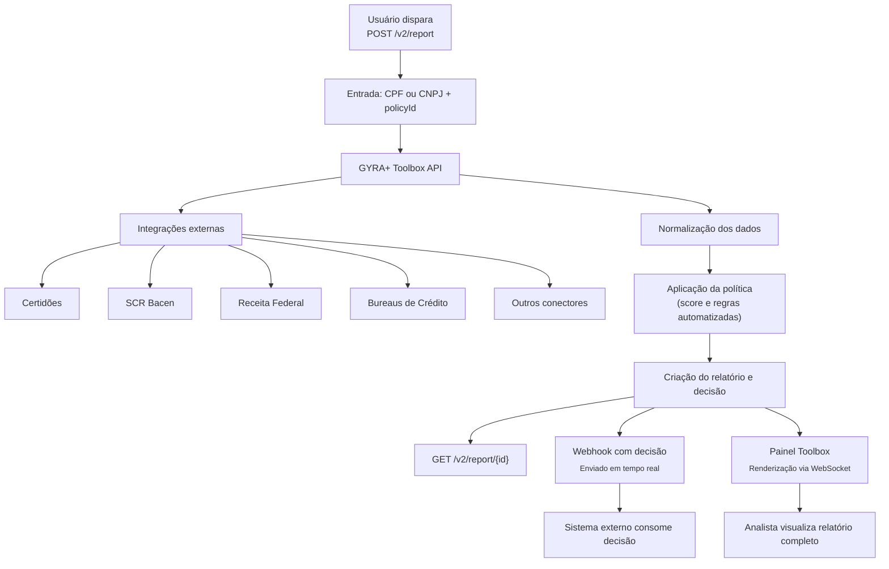

A API da GYRA+ foi construída para entregar **respostas em tempo real** com alto nível de personalização por cliente e por tipo de política.

O fluxo padrão é simples:

```mermaid
flowchart TD
  A["Usuário dispara<br>POST /v2/report"] --> B["Entrada: CPF ou CNPJ + policyId"]
  B --> C["GYRA+ Toolbox API"]
  C --> D["Integrações externas"]
  D --> D1["Certidões"]
  D --> D2["SCR Bacen"]
  D --> D3["Receita Federal"]
  D --> D4["Bureaus de Crédito"]
  D --> D5["Outros conectores"]
  C --> E["Normalização dos dados"]
  E --> F["Aplicação da política<br>(score e regras automatizadas)"]
  F --> G["Criação do relatório e decisão"]

  G --> H1["GET /v2/report/{id}"]
  G --> H2["Webhook com decisão<br><sub>Enviado em tempo real</sub>"]
  G --> H3["Painel Toolbox<br><sub>Renderização via WebSocket</sub>"]

  H2 --> I1["Sistema externo consome decisão"]
  H3 --> I2["Analista visualiza relatório completo"]
```

## Eventos em tempo real

Após o envio do documento via `POST /v2/report`, o relatório é processado de forma assíncrona. O resultado pode ser consultado de duas maneiras:

- **Webhook:** se configurado, a GYRA+ envia um POST para o seu endpoint a cada evento do relatório. Ver [Criar Webhook](/api-reference/webhook/post-webhook).
- **Consulta:** [`GET /v2/report/{id}`](/api-reference/report-v2/get-v2report) devolve o status e o conteúdo a qualquer momento.

No Toolbox, o relatório se atualiza na tela sozinho, sem recarregar a página.

---

## Próximo passo

Gere as credenciais em [Chaves de API](/api-reference/api-keys) e troque-as por um token em [Gerar Token](/api-reference/auth/post-authauthenticate).
