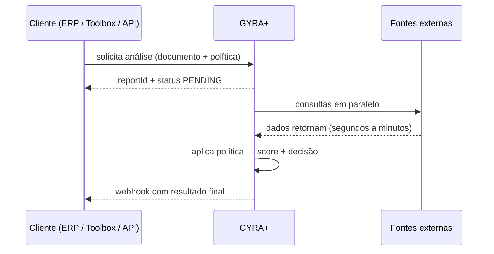

<Info>
  **Resumo:** análise de crédito na GYRA+ é o processo de **consultar várias fontes de dados sobre uma pessoa ou empresa, aplicar uma política de regras sobre esses dados e retornar uma decisão final** (aprovado, alerta ou negado) com score e justificativa auditável.
</Info>

## O que a GYRA+ faz

Quando você pede uma análise, via Toolbox, API ou MCP, a GYRA+ executa quatro etapas:

1. **Coleta:** consulta em paralelo todas as fontes configuradas (cadastrais, bureaus de crédito, SCR/Open Finance, processos, protestos, PEP/sanções, etc).
2. **Consolidação:** normaliza e monta o [relatório](/concepts/relatorio) em seções padronizadas.
3. **Avaliação:** aplica a [política de crédito](/concepts/politica-de-credito) configurada: cada regra lê um campo do relatório, compara com um threshold e contribui para o score e a decisão.
4. **Decisão:** retorna status final, score, lista de regras disparadas e o JSON completo do relatório.

Tudo isso é **auditável**: você vê exatamente qual campo veio de qual fonte, qual regra disparou, qual peso teve e como o score foi somado.

## O que ela não faz

- **Não substitui decisão humana em casos limítrofes.** `ALERT` existe justamente para marcar o caso como "revisão manual".
- **Não é consultoria financeira.** A GYRA+ entrega dados e aplica a política que você definiu, o julgamento do apetite de risco é seu.
- **Não garante que o tomador vai pagar.** Crédito tem risco residual sempre; a análise reduz, não elimina.
- **Não altera o dado da fonte.** Se a base de origem está defasada, a GYRA+ entrega o que foi publicado lá.

## Ciclo de vida de uma análise

Para o fluxo assíncrono completo, ver [Webhooks e Tempo Real](/concepts/webhooks-e-tempo-real).

## Tipos de análise

A GYRA+ suporta análise de:

- **Pessoa física (CPF):** individual, normalmente para crédito pessoal, cartão, consignado, locação, contratação de RH.
- **Pessoa jurídica (CNPJ):** individual, para crédito PJ, vendas a prazo, cartão corporativo, KYC.
- **PJ + vínculos:** analisa o CNPJ-raiz e, em cascata, sócios, filiais, parentes ou empresas no mesmo endereço. Esse fluxo é modelado via [Operação](/concepts/operacoes).

## Resultado

A resposta de uma análise sempre inclui:

| Campo | O que é |
| ----- | ------- |
| `status` | Decisão final: `APPROVED`, `DENIED`, `ALERT`. |
| `policyStatus` | Decisão vinda da política de crédito aplicada. |
| `score` | Valor sintético de 0 a 1000 (quando a política usa score). |
| `document` / `type` | Documento analisado e se é CPF ou CNPJ. |
| Seções do relatório | JSON detalhado com cada fonte consultada. |

Para entender como `score` e `status` são calculados, ver [Score e Decisão](/concepts/score-e-decisao).

## Quando usar qual caminho

<CardGroup cols={2}>
  <Card title="Toolbox (web)" icon="browser" href="/toolbox/rodar-operacao">
    Análise ad-hoc, análise em lote (CSV), revisão humana. Ideal para mesa de crédito e compliance.
  </Card>
  <Card title="API (servidor)" icon="code" href="/api-reference/report/post-report">
    Integração com ERP, onboarding, checkout. Recebe resultado via webhook.
  </Card>
  <Card title="MCP (agentes de IA)" icon="robot" href="/mcp/o-que-e">
    Consulta feita por agente LLM, ex: "rode uma análise no CNPJ X e me resuma".
  </Card>
  <Card title="n8n / no-code" icon="diagram-project" href="/docs/integracao-n8n">
    Workflows automatizados sem escrever código.
  </Card>
</CardGroup>

## Próximos passos

<CardGroup cols={2}>
  <Card title="Política de Crédito" icon="scale-balanced" href="/concepts/politica-de-credito">
    Como a análise é parametrizada em regras.
  </Card>
  <Card title="Operações" icon="arrows-split-up-and-left" href="/concepts/operacoes">
    Como encadear análises em cascata (PJ + sócios + filiais).
  </Card>
  <Card title="Score e Decisão" icon="chart-line" href="/concepts/score-e-decisao">
    Como o score final é composto.
  </Card>
  <Card title="Relatório" icon="file-lines" href="/concepts/relatorio">
    A estrutura do objeto que sai da análise.
  </Card>
</CardGroup>
