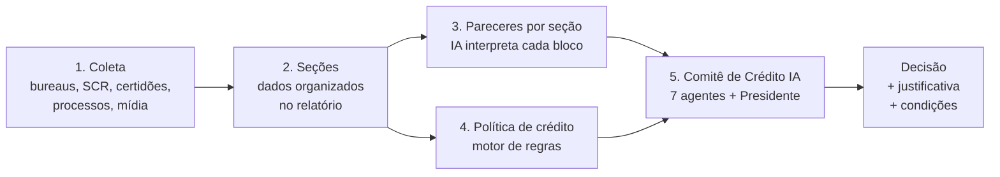
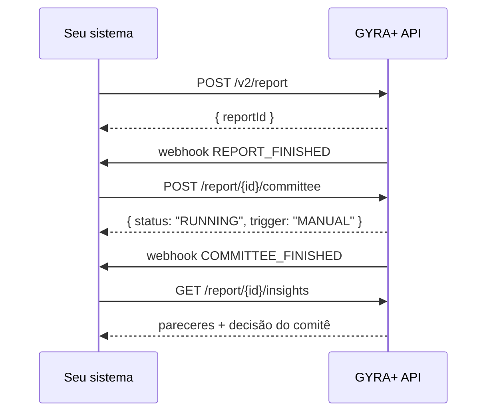

<Info>
  **Resumo:** o Comitê de Crédito IA reproduz um comitê humano. Depois que a GYRA+ gera os **pareceres por seção** e a **política de crédito** conclui, **sete agentes especialistas** analisam o caso em paralelo (cada um no seu domínio) e um **Presidente** reconcilia tudo numa decisão única, com justificativa, condições, registro de divergência e nível de alçada. O comitê pode rodar **automaticamente** (configurado na política) ou ser **convocado manualmente** no relatório ou via API. Nos planos **Business** e **Enterprise**, sua instituição adiciona instruções próprias aos agentes, para o comitê deliberar com o apetite e a política interna da casa.
</Info>

## Onde o comitê entra

O comitê é a **última camada** da análise. Ele não lê dado cru: lê o que as camadas anteriores já processaram.

Isso tem duas consequências práticas:

1. O comitê **só roda depois** que os pareceres por seção e a política terminam. Não existe comitê no meio do processamento.
2. O comitê **não substitui a política**. A política continua sendo a régua da casa; o comitê traz a leitura qualitativa que a regra numérica não captura, e (dependendo do modo) sugere ou aplica a decisão.

<Note>
  Não confunda com os [Pareceres GYRA+ IA](/concepts/pareceres-gyra-ia). O parecer é a leitura **de uma seção** isolada. O comitê é a deliberação **sobre o conjunto** dos pareceres, e produz uma decisão.
</Note>

---

## Os agentes

Sete especialistas rodam em paralelo, cada um enxergando apenas os pareceres do seu domínio. Depois, o Presidente lê os sete e decide.

| Agente | Papel | Pareceres que enxerga |
| ------ | ----- | --------------------- |
| **Cadastral** | Integridade cadastral e retrato atual do negócio | Informações básicas, Localização, Certidões, Licenças e autorizações |
| **Societário** | Quadro societário, grupo econômico e vínculos | Vínculos societários |
| **Financeiro** | Demonstrações, indicadores e capacidade de pagamento | Análise financeira (balanço e DRE) |
| **Comportamental** | Comportamento de pagamento e uso de crédito | Bureau, SCR, Pefin/Refin, Protestos, Inteligência de pagamentos |
| **Jurídico** | Exposição judicial e regularidade | Processos, Certidões, Sanções |
| **Macro e Setorial** | Contexto de mercado e do setor de atuação | Setor |
| **Compliance** | KYC, reputação e integridade | Sanções, PEP, Exposição em mídia, Antecedente criminal |
| **Presidente** | Reconcilia os sete pareceres e assina a decisão | Todos os pareceres acima + resultado e objetivo da política |

<Tip>
  O agente **Cadastral** é o único com acesso a **busca na web**. Ele pesquisa a razão social ou o nome antes de opinar, para montar um retrato atualizado do que a empresa faz de fato, porte real e notoriedade recente. Os demais agentes trabalham exclusivamente com os dados do relatório.
</Tip>

### O que cada agente devolve

Cada especialista produz uma opinião estruturada:

- `score` (0 a 10) no domínio dele;
- `resumo`: uma frase executiva com a posição e o motivo;
- `parecer`: a deliberação completa;
- `redFlags`: alertas classificados como `CRITICAL` ou `WARNING`;
- `positiveFactors`: fatores que sustentam a operação;
- `recommendation`: `APPROVE`, `APPROVE_WITH_RESTRICTION`, `REJECT` ou `ESCALATE`;
- `confidence` (0 a 1) e `infoGaps`: o que faltou de informação para decidir com mais segurança.

---

## A decisão do Presidente

O Presidente devolve **uma** decisão para o relatório:

| Decisão | Significado |
| ------- | ----------- |
| `APPROVED` | Aprovar. Pode vir com `conditions` (aprovar com ressalvas). |
| `REJECTED` | Negar. |
| `REQUIRES_ALCADA` | Escalar para uma alçada superior; o campo `alcadaLevel` indica o nível. |
| `NEEDS_INFO` | Falta informação essencial. `infoGapsBeforeDecision` lista o que buscar antes de decidir. |

Junto da decisão vêm:

- `resumo` e `reasoning`: a justificativa executiva e a completa;
- `proximaAcao`: o próximo passo recomendado ao analista;
- `conditions`: ressalvas para aprovar (garantia adicional, redução de limite, etc.);
- `dissentLog`: **registro de divergência**, quais agentes discordaram e como. É o que torna a decisão auditável;
- `monitoringItems`: o que acompanhar depois do desembolso;
- `limitReview`: avaliação do limite, taxa e prazo sugeridos pela política, com status `ADEQUADO`, `REVISAR` ou `SEM_PARAMETROS`;
- `confidence`: confiança agregada da deliberação.

---

## Quando o comitê é convocado

### As três configurações da política

Na edição da política de crédito, o bloco **Comitê de Crédito IA** oferece três opções, e você escolhe uma:

<CardGroup cols={1}>
  <Card title="1. Não convocar automaticamente" icon="hand">
    O comitê **não** roda sozinho. Ele só delibera quando alguém convoca: pelo botão **Convocar Comitê** dentro do relatório, ou por [`POST /report/{id}/committee`](/api-reference/report/post-reportcommittee). É o modo em que o comitê fica sob demanda, para você levar a comitê só os casos que quiser.
  </Card>
  <Card title="2. Convocar comitê e sugerir decisão" icon="lightbulb">
    O comitê roda sozinho assim que a análise fecha e **sugere** a decisão. Aprovar ou negar continua com o analista, pela tela do relatório ou por [`POST /report/analyze`](/api-reference/report/post-reportanalyze). A deliberação entra como recomendação, não muda o status do relatório.
  </Card>
  <Card title="3. Convocar comitê e decisão automática" icon="robot">
    O comitê roda sozinho e **aplica** a decisão do Presidente no status do relatório, sem passar por um humano. Só `APPROVED` e `REJECTED` são aplicados; `REQUIRES_ALCADA` e `NEEDS_INFO` ficam registrados como sugestão e continuam esperando um analista.
  </Card>
</CardGroup>

<Note>
  Não existe uma opção chamada "manual" na lista. Quem cumpre esse papel é a **primeira** delas, *Não convocar automaticamente*: o comitê fica disponível no relatório, mas só delibera se for convocado.
</Note>

A diferença entre a segunda e a terceira é só **quem assina a decisão**: nas duas o comitê roda sozinho, mas na segunda ele recomenda e na terceira ele decide.

### Origem da convocação (`trigger`)

Toda deliberação registra de onde veio, no campo `trigger`:

| `trigger` | Origem |
| --------- | ------ |
| `AUTO_SUGGEST` | Automático, política em *Convocar comitê e sugerir decisão*. |
| `AUTO_DECIDE` | Automático, política em *Convocar comitê e decisão automática*. |
| `MANUAL` | Convocação manual (botão ou API), primeira deliberação do relatório. |
| `RERUN` | Convocação manual em um relatório que **já tinha** uma deliberação. |

<Warning>
  Convocação manual **sempre entra como sugestão**. Mesmo numa política em *Convocar comitê e decisão automática*, uma deliberação convocada pelo botão ou pela API não altera o status do relatório: a decisão volta a ser do analista. Só o gatilho automático dessa política aplica o status.
</Warning>

### Pré-requisitos

O comitê só delibera quando **todas** estas condições valem:

<Steps>
  <Step title="A política habilita o pipeline de parecer">
    Sem parecer por seção não há insumo para o comitê. Políticas sem o pipeline de parecer nunca convocam comitê.
  </Step>
  <Step title="Os pareceres por seção terminaram">
    O relatório precisa estar com a geração de pareceres concluída. Se alguma seção falhou, o comitê ainda roda, os agentes declaram o que faltou em `infoGaps` em vez de inventar.
  </Step>
  <Step title="A política de crédito concluiu">
    Se o relatório tem política associada, o resultado dela precisa ter chegado.
  </Step>
  <Step title="Não há outra deliberação em andamento">
    Enquanto o status estiver `RUNNING`, uma nova convocação é recusada.
  </Step>
</Steps>

### Quando o comitê é pulado

Se a política está com **"Usar resultado da política no relatório"** ativo e a política **rejeitou** o caso, o comitê não é convocado e o status fica `SKIPPED`. Política rejeitada não vai a comitê.

Um relatório com status `SKIPPED` ainda pode ser levado a comitê manualmente.

---

## Estados da deliberação

| Status | Significado |
| ------ | ----------- |
| `RUNNING` | Os agentes estão deliberando. Leva menos de um minuto na maioria dos casos. |
| `DONE` | Deliberação concluída, decisão disponível. |
| `ERROR` | A deliberação falhou. Pode ser reconvocada. |
| `SKIPPED` | Comitê não convocado (ver acima). Pode ser convocado manualmente. |

Reconvocar é permitido a partir de `DONE`, `ERROR` e `SKIPPED`. Nunca por cima de `RUNNING`.

---

## Como usar pela API

<CardGroup cols={3}>
  <Card title="Convocar" icon="gavel" href="/api-reference/report/post-reportcommittee">
    `POST /report/{id}/committee`
  </Card>
  <Card title="Consultar pareceres" icon="file-lines" href="/api-reference/report/get-reportinsights">
    `GET /report/{id}/insights`
  </Card>
  <Card title="Consultar deliberação" icon="scale-balanced" href="/api-reference/committee/get-committeedeliberations">
    `GET /committee/deliberations/{reportId}`
  </Card>
</CardGroup>

O fluxo típico de uma integração com comitê manual:

<Tip>
  Registre o webhook [`COMMITTEE_FINISHED`](/api-reference/webhook/post-webhook) em vez de fazer polling. O payload é fino de propósito (decisão + síntese); o detalhe completo você busca em `GET /report/{id}/insights` ou `GET /committee/deliberations/{reportId}`.
</Tip>

---

## Instruções da sua instituição nos agentes

<Info>
  Disponível nos planos **Business** e **Enterprise**. Fale com `atendimento@gyramais.com` para habilitar na sua organização.
</Info>

Cada agente do comitê tem um **prompt-base GYRA+** (não editável) e um campo de **instruções adicionais** que a sua instituição escreve. Com o recurso habilitado, o bloco **Instruções adicionais dos agentes** aparece na edição da política de crédito, com um campo por agente, incluindo o Presidente.

É onde entram o apetite de risco, os critérios do setor e a política interna da casa. Exemplos do que costuma ser escrito:

- No **Financeiro**: "Para transportadoras, considerar imobilizado alto como característica do setor, não como má gestão de capital."
- No **Jurídico**: "Nossa alçada tolera execuções fiscais abaixo de 5% do faturamento anual; acima disso, escalar."
- No **Comportamental**: "Concentração acima de 60% em conta garantida é sinal de estresse na nossa carteira."
- No **Presidente**: "Operações acima de R$ 500 mil sempre exigem alçada, mesmo com parecer favorável."

### O que as instruções podem e não podem fazer

As instruções são **complementares**. Elas calibram a análise, mas nunca sobrepõem as regras do GYRA+:

| Pode | Não pode |
| ---- | -------- |
| Definir apetite de risco e tolerâncias | Alterar o formato de saída da deliberação |
| Trazer particularidades do setor que você opera | Sobrepor a soberania da política de crédito |
| Ajustar o peso de sinais específicos na leitura | Desativar regras de compliance |
| Registrar critérios internos de alçada | Mudar o idioma da resposta |

Ao salvar, o texto passa por uma **validação anti-injeção**: instruções que tentam fazer o agente ignorar regras anteriores, mudar o formato da resposta ou aprovar/negar incondicionalmente são recusadas com uma mensagem explicando o motivo. Reescreva como orientação de análise. O limite é de **4.000 caracteres por agente**, e deixar o campo vazio remove a customização e volta ao comportamento padrão.

<Note>
  Cada deliberação registra qual versão de prompt cada agente usou. Isso permite auditar a relação entre uma mudança de instrução e o comportamento das decisões seguintes.
</Note>

---

## Perguntas frequentes

<AccordionGroup>
  <Accordion title="O comitê decide sozinho pelo meu cliente?">
    Só na terceira configuração, **Convocar comitê e decisão automática**, e apenas quando a decisão do Presidente for `APPROVED` ou `REJECTED`. Nas outras duas, e em toda convocação manual, o comitê sugere e o analista decide.
  </Accordion>
  <Accordion title="Posso convocar o comitê mais de uma vez no mesmo relatório?">
    Sim. Reconvocar a partir de `DONE`, `ERROR` ou `SKIPPED` gera uma nova deliberação com `trigger: "RERUN"`. Não é possível reconvocar enquanto uma deliberação está `RUNNING`.
  </Accordion>
  <Accordion title="Quanto tempo leva?">
    Os sete agentes rodam em paralelo. Na maioria dos casos a deliberação fecha em menos de um minuto.
  </Accordion>
  <Accordion title="O que acontece se uma seção do relatório falhou?">
    O comitê ainda delibera com o que existe. Os agentes declaram explicitamente o que faltou em `infoGaps`, e o Presidente pode devolver `NEEDS_INFO` se a lacuna for determinante.
  </Accordion>
  <Accordion title="O comitê aparece no PDF exportado?">
    A deliberação fica no relatório na plataforma e disponível por API. Para o conteúdo do PDF, consulte [Relatório](/concepts/relatorio).
  </Accordion>
</AccordionGroup>

## Próximos passos

<CardGroup cols={2}>
  <Card title="Política de Crédito" icon="scale-balanced" href="/concepts/politica-de-credito">
    Onde o modo do comitê é configurado.
  </Card>
  <Card title="Convocar o Comitê (API)" icon="gavel" href="/api-reference/report/post-reportcommittee">
    Disparar a deliberação pela API.
  </Card>
  <Card title="Webhooks e Tempo Real" icon="webhook" href="/concepts/webhooks-e-tempo-real">
    Receber `COMMITTEE_FINISHED` sem polling.
  </Card>
  <Card title="Pareceres GYRA+ IA" icon="sparkles" href="/concepts/pareceres-gyra-ia">
    Os pareceres por seção que alimentam o comitê.
  </Card>
</CardGroup>
