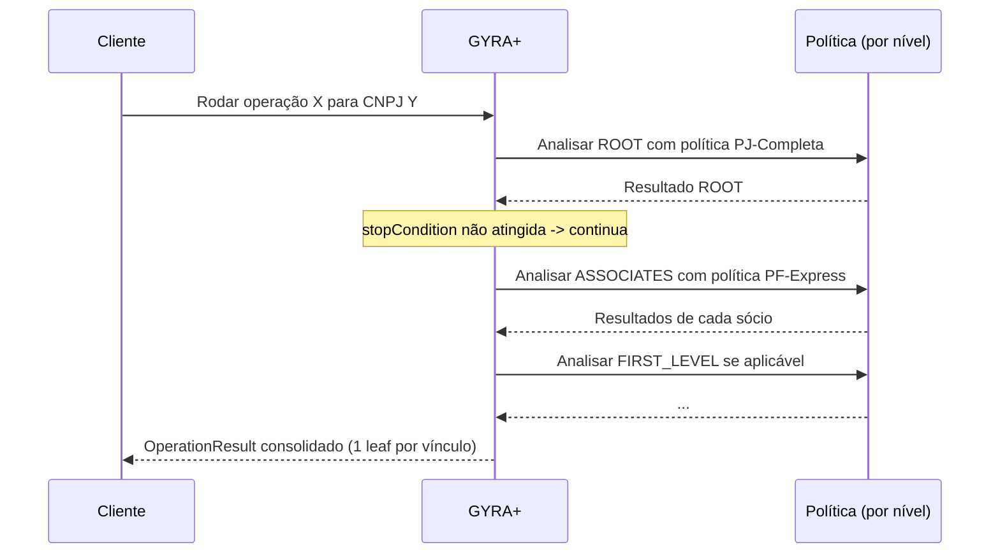

<Info>
  **Resumo:** uma **Operação** é uma receita reutilizável que diz "quando eu analisar este tipo de documento, quero também analisar vínculos relacionados, em ordem, aplicando políticas específicas para cada nível". Útil principalmente para PJ, onde a decisão depende dos sócios, filiais e empresas relacionadas.
</Info>

## Por que existem

Uma análise isolada de um CNPJ é útil, mas muitas vezes **o risco real está nos vínculos**: sócios com histórico ruim, filiais em situação irregular, empresas ligadas por mesmo endereço. Reproduzir isso manualmente é lento e inconsistente.

A Operação resolve isso: você desenha o fluxo uma única vez e, a cada análise, a GYRA+ executa a cascata de relatórios conforme as regras de parada que você definiu.

## Anatomia de uma operação

Uma operação tem três blocos:

| Bloco | O que define |
| ----- | ------------ |
| **Cabeçalho** | Nome, tipo de documento raiz (`CPF` ou `CNPJ`), condição de entrada. |
| **Etapas (settings)** | Lista ordenada de níveis de vínculo a analisar, cada um com sua política e condição de parada. |
| **Versão** | Toda alteração gera nova versão; resultados ficam atrelados à versão que rodou. |

### Níveis de vínculo disponíveis

| Nível | O que é analisado |
| ----- | ------------------ |
| `ROOT` | O documento principal (CPF ou CNPJ da solicitação). |
| `ASSOCIATES` | Sócios/representantes do `ROOT`. |
| `FIRST_LEVEL` | Sócios ou participações societárias que o `ROOT` possui. |
| `SECOND_LEVEL` | Vínculos de 2º nível. |
| `THIRD_LEVEL` | Vínculos de 3º nível. |
| `BRANCH_OFFICE` | Filiais do CNPJ-raiz (mesma matriz). |
| `SAME_ADDRESS` | Outras empresas no mesmo endereço. |
| `KINSHIP` | Parentesco (para análise PF). |

Cada etapa pode cobrir **um ou mais** níveis simultaneamente.

### Condição de entrada (`condition`)

Define quando a etapa seguinte deve rodar:

| Valor | Significado |
| ----- | ----------- |
| `IF_COMPLETED` | Roda depois que o relatório principal **termina**, independente do resultado. |
| `IF_APPROVED` | Roda apenas se o principal for **aprovado**. |
| `IF_REPROVED` | Roda apenas se o principal for **reprovado**. |

### Condição de parada (`stopCondition`)

Define quando interromper a cascata para **aquele vínculo específico**:

| Valor | Significado |
| ----- | ----------- |
| `NEVER` | Analisa todos os vínculos até o fim, não para. |
| `IF_APPROVED` | Para de aprofundar se o vínculo foi aprovado. |
| `IF_REPROVED` | Para de aprofundar se o vínculo foi reprovado. |

## Ciclo de vida de uma execução



### Estados de cada folha (`OperationResultLeaf`)

Cada vínculo analisado recebe um estado:

| Estado | Quando |
| ------ | ------ |
| `NOT_STARTED` | Ainda não entrou na fila. |
| `PENDING` | Em processamento. |
| `COMPLETED` | Terminou e a política não deu veredito binário. |
| `APPROVED` | Aprovado pela política. |
| `REPROVED` | Reprovado pela política. |
| `SKIPPED` | Pulado por `stopCondition` ou filtro. |
| `ERROR` | Falhou no meio do caminho, fontes externas podem ter rejeitado. |

## Resultado agregado

A execução produz um `OperationResult` que contém:

- O documento raiz analisado.
- A versão da operação que rodou (rastreabilidade: se você editou depois, o resultado antigo ainda aponta para a versão antiga).
- Uma lista de `OperationResultLeaf`, um por vínculo analisado, com status, referência ao relatório detalhado e o nível de vínculo.

No Toolbox, isso vira uma árvore: raiz em cima, vínculos expandidos por nível, status colorido em cada nó.

## Exemplo concreto

**Cenário:** fintech de crédito PJ quer aprovar empresas só se a empresa **e** seus sócios estiverem limpos.

```
Operação: "Aprovação PJ com sócios"
├── ROOT → Política "PJ Premium com SCR" (stopCondition: NEVER)
└── ASSOCIATES → Política "PF Express" (stopCondition: IF_REPROVED)
    └── condition: IF_APPROVED (só roda se o ROOT aprovou)
```

Leitura em português: "rode a política PJ Premium no CNPJ. Se reprovou, pare. Se aprovou, rode a política PF Express em cada sócio, se qualquer sócio reprovar, não vale a pena aprofundar, entregue o veredito."

## Versionamento e rastreabilidade

- Toda alteração de operação **cria nova versão** (campo `version`).
- `OperationResult` armazena qual versão rodou.
- Mudanças ficam registradas em `OperationChange` com autor e tipo (`EDITED`, `ADDED`, `REMOVED`).
- Isso garante que um resultado do mês passado continue explicável mesmo que você tenha mexido na operação hoje.

## Próximos passos

<CardGroup cols={2}>
  <Card title="Rodar uma operação" icon="play" href="/toolbox/rodar-operacao">
    Passo a passo no Toolbox.
  </Card>
  <Card title="Interpretar o resultado" icon="list-check" href="/toolbox/interpretar-resultado-operacao">
    Como ler a árvore de vínculos e tomar decisão.
  </Card>
  <Card title="Política de Crédito" icon="scale-balanced" href="/concepts/politica-de-credito">
    Cada etapa da operação usa uma política, entenda como configurá-la.
  </Card>
  <Card title="Relatório" icon="file-lines" href="/concepts/relatorio">
    Cada folha da operação gera um relatório completo.
  </Card>
</CardGroup>
