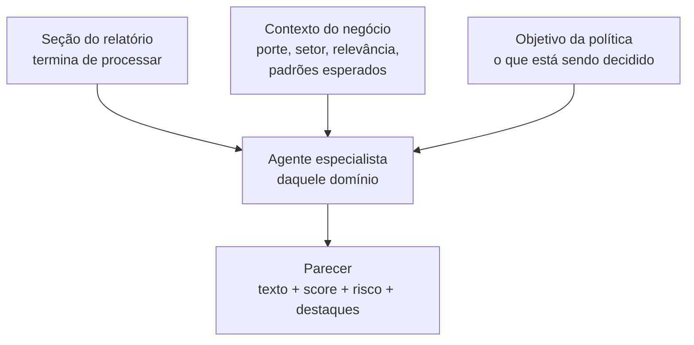

<Info>
  **Resumo:** nos relatórios **COMPLETO** e **COMPLETO+**, cada seção não chega só com dados: chega com um **parecer**. Um agente de IA especialista naquele domínio lê a seção no contexto real do negócio analisado e devolve **texto do parecer**, **score de 0 a 10**, **nível de risco** e **destaques**. São 21 seções cobertas, e está **incluído no relatório**, sem custo adicional. É a diferença entre receber uma lista de processos e receber a leitura de um advogado sobre aqueles processos.
</Info>

## O problema que isso resolve

Um relatório de crédito completo devolve centenas de campos. Processos judiciais, endividamento bancário mês a mês, certidões, quadro societário, protestos, exposição em mídia. O dado está todo lá, e é justamente esse o problema: **o dado bruto transfere o trabalho de interpretação para você**.

Trinta processos trabalhistas são muitos? Depende. Para uma transportadora com 400 funcionários é o esperado; para uma consultoria com 12, é um sinal. Um imobilizado alto é má gestão de capital ou é a natureza do setor? Concentração em conta garantida é estresse de caixa ou é como aquele segmento sempre operou?

**A resposta é sempre "depende do negócio".** É exatamente isso que o parecer resolve: cada agente recebe o contexto real da empresa ou pessoa antes de opinar, e avalia a seção contra o que é normal para aquele porte, aquele setor e aquele perfil.

---

## Como funciona



O parecer é reativo por seção: assim que **uma** seção fecha, o agente dela já roda. Você não espera o relatório inteiro para começar a ler análise.

O **objetivo** vem do campo *Objetivo* da política, em *Decisão e alçada* (ver [Criar Política](/toolbox/criar-politica)). É ele que calibra a leitura: a mesma rede de vínculos e os mesmos processos pesam diferente numa política de capital de giro e numa de contratação de pessoal, onde não há desembolso a proteger. Todos os agentes recebem o mesmo objetivo, inclusive o [Comitê de Crédito IA](/concepts/comite-de-credito).

### O contexto vem primeiro

Antes de qualquer parecer, um **agente-mãe** analisa a seção de informações básicas com busca na web e monta o **contexto do negócio**: o que a empresa faz de fato, porte real, relevância no setor e quais padrões são esperados para esse perfil. Só depois os demais agentes rodam, cada um já sabendo com quem está lidando.

<Tip>
  Essa ordem é o que separa um parecer útil de um resumo genérico. Sem contexto, um agente só consegue dizer "existem 30 processos". Com contexto, ele diz se 30 processos são muitos **para essa empresa**. Nenhuma seção é analisada sem o contexto pronto.
</Tip>

---

## O que você recebe

Cada seção analisada devolve quatro coisas:

<CardGroup cols={2}>
  <Card title="Parecer" icon="file-lines">
    O texto. A leitura crítica da seção escrita como um especialista do domínio escreveria: o que importa, o que é ruído, e o que isso significa para a decisão.
  </Card>
  <Card title="Score de 0 a 10" icon="gauge">
    A nota do agente naquele domínio, por uma **rubrica determinística**: a mesma empresa com os mesmos dados gera o mesmo score.
  </Card>
  <Card title="Nível de risco" icon="triangle-exclamation">
    `LOW`, `MEDIUM`, `HIGH` ou `CRITICAL`. Serve para ordenar a fila da mesa e cortar por régua sem ler o texto.
  </Card>
  <Card title="Destaques" icon="list-check">
    Os pontos estruturados que sustentam o parecer. É o que vira badge na tela e filtro na sua integração.
  </Card>
</CardGroup>

Na API, os quatro chegam juntos em [`GET /report/{id}/insights`](/api-reference/report/get-reportinsights):

```json
{
  "section": "PROCESSES",
  "score": 6,
  "riskLevel": "MEDIUM",
  "parecer": "A empresa figura em 4 processos trabalhistas, volume compatível com o porte e o setor de atuação. Nenhum deles é execução, e o valor agregado representa menos de 2% do faturamento estimado...",
  "highlights": ["4 processos trabalhistas ativos", "Sem execuções fiscais"],
  "at": "2026-07-30T14:22:03.881Z"
}
```

---

## Seções com parecer

São **21 seções** cobertas. Cada uma tem um agente com a régua do seu domínio:

| Seção | `sectionType` | O que o agente avalia |
| ----- | ------------- | --------------------- |
| Informações Básicas | `BASIC_INFORMATION` | **Agente-mãe.** Retrato atualizado do negócio com busca na web: o que faz de fato, porte real, relevância e padrões esperados. Produz o contexto que alimenta todos os outros. |
| Localização | `LOCATION` | Coerência entre a fachada, o endereço e o negócio declarado. Usa as imagens do local. Em relatório de PF a régua é residencial: avalia o imóvel declarado, não um ponto comercial. |
| Vínculos Societários | `RELATIONS` | Quadro societário, grupo econômico, natureza e vigência dos vínculos, e comparação de CNAE e endereço com a empresa principal. |
| Processos Judiciais | `PROCESSES` | Natureza, matéria, materialidade e **papel processual** do avaliado, ponderados pelo porte. |
| Certidões | `CERTIFICATES` | Regularidade fiscal, trabalhista e FGTS, e o peso real de cada irregularidade. |
| Licenças e Autorizações | `LICENSES_AUTHORIZATIONS` | Licenças obrigatórias para a atividade exercida e o que a ausência de cada uma implica. |
| PEP | `PEP` | Exposição política e o vínculo concreto com a operação. |
| Sanções | `SANCTIONS` | Listas restritivas nacionais e internacionais, com leitura de severidade. |
| Exposição em Mídia | `MEDIA_EXPOSURE` | Notícias relevantes, sentimento e risco reputacional recente. |
| Antecedente Criminal | `CRIMINAL_RECORD` | Antecedentes e mandados de prisão. Só em relatórios de PF. |
| Programas Sociais | `SOCIAL_ASSISTANCE_PROGRAMS` | Perfil de renda e capacidade a partir de benefícios sociais. Só em relatórios de PF. |
| Score | `SCORE` | O score de bureau lido no contexto do negócio, não como número solto. |
| SCR | `SCR` | Mix de produtos bancários, concentração por modalidade e o que indica sobre o uso de crédito. |
| Resumo SCR | `SCR_SUMMARY` | Evolução do endividamento, tendência e sinais de estresse financeiro. |
| Pefin | `PEFIN` | Restritivos de credores não financeiros, com leitura de recorrência e materialidade. |
| Refin | `REFIN` | Restritivos de instituições financeiras. |
| Protestos | `PROTESTS` | Protestos em cartório, volume, valores e janela temporal. |
| Cheques sem Fundo | `BAD_CHECK` | Ocorrências e o que sinalizam sobre a gestão de caixa. |
| Dívidas Vencidas | `PAST_DUE_DEBT` | Dívidas em aberto e seu peso relativo. |
| Análise Financeira | `BALANCE_SHEET` | Balanço, DRE e mais de 30 indicadores lidos como um analista financeiro leria, com as particularidades do setor. |
| Setor | `SECTOR` | Panorama macro e setorial, com perspectiva de curto, médio e longo prazo. |

<Note>
  As seções de PF (`CRIMINAL_RECORD`, `SOCIAL_ASSISTANCE_PROGRAMS`) só existem em relatórios de CPF, e a Análise Financeira depende do envio do balanço. O parecer aparece nas seções que o relatório efetivamente gerou.
</Note>

---

## O que o agente não confunde

Parte do trabalho do parecer é qualificar o dado bruto antes de opinar. Três distinções valem citar, porque são exatamente onde uma leitura ingênua da seção erra:

<AccordionGroup>
  <Accordion title="Presença nos autos não é passivo (PROCESSES)">
    O polo do processo (`ATIVO` / `PASSIVO` / `OUTROS`) não diz o quanto o avaliado está exposto. O agente recebe o **papel processual** derivado do papel detalhado da parte, e distingue quem é polo passivo de quem aparece como **credor**, **terceiro interessado** ou **não parte** (advogado, juiz, perito, administrador judicial). Processos em que o avaliado não é litigante pesam pouco ou nada no parecer.

    Na mesma linha, o agente separa **recuperação judicial, recuperação extrajudicial e falência** de homônimos que não são insolvência (REFIS, recuperação fiscal, recuperação de crédito), e distingue quem é o **devedor** de quem é **credor** no processo de insolvência.

    Os processos dos sócios chegam identificados como tal, com a ressalva de que naquele feed o polo do sócio não é determinável. Não entram na contagem de insolvência do avaliado.
  </Accordion>
  <Accordion title="Restrição de terceiro não vira exposição do avaliado (RELATIONS)">
    O agente recebe a **natureza** de cada vínculo, e não apenas a existência da ligação: sócio (participa do capital do avaliado), participação (o avaliado participa do capital de outra), administrador (gestão sem capital), empregador, parente e social (colega de faculdade, de trabalho, vizinho).

    A distinção tem efeito prático: a dívida de uma empresa **empregadora** aparece no parecer como contexto ocupacional, não como passivo da pessoa avaliada. Vínculo de gestão continua entrando na exposição, porque quem administra responde pela gestão.

    Cada vínculo também chega com **vigência**: encerrado, sem fim informado (sugere em curso, não confirma) ou sem data. O parecer não trata "sem data de fim" como vínculo atual.
  </Accordion>
  <Accordion title="Sem imagem não é fachada ruim (LOCATION)">
    O agente diferencia **não conseguimos confirmar este endereço** (imagem inconclusiva, obra em andamento, foto obstruída ou antiga, panorama distante) de **a imagem mostra um problema** (terreno baldio, imóvel demolido, obra abandonada, ruína). Os dois desfechos eram indistinguíveis antes, e o caso ruim saía de graça.

    Quando não existe nenhuma imagem do endereço, a fachada não é pontuada: fica indisponível em vez de receber uma nota que leria como "avaliamos e está razoável".
  </Accordion>
</AccordionGroup>

---

## Disponibilidade

| Tipo de relatório | Pareceres |
| ----------------- | --------- |
| **COMPLETO** | Incluído, todas as seções do relatório |
| **COMPLETO+** | Incluído, todas as seções do relatório |
| ESSENCIAL | Não incluído |

Não é add-on nem consumo à parte: nesses relatórios os pareceres **já vêm por padrão**, sem custo adicional e sem configuração. Se a sua política gera relatório COMPLETO ou COMPLETO+, as seções já estão chegando analisadas.

<Tip>
  O parecer também é o insumo do [Comitê de Crédito IA](/concepts/comite-de-credito). Sete agentes especialistas e um Presidente leem o **conjunto** dos pareceres e devolvem uma decisão de crédito com justificativa e condições. Parecer é a leitura de uma seção; comitê é a decisão sobre todas elas.
</Tip>

---

## Onde aparece

- **No toolbox**, dentro da própria seção analisada, em bloco destacado com o score e o nível de risco em badge.
- **Na API**, em [`GET /report/{id}/insights`](/api-reference/report/get-reportinsights), que devolve só os pareceres, sem os payloads pesados de integração. Aceita `?section=` para trazer um só.
- **No PDF exportado**, integrado ao corpo da seção correspondente.
- **Em tempo real**, cada parecer é publicado assim que fica pronto, sem esperar o relatório inteiro.

### Estado do parecer

Cada seção carrega o estado do seu parecer, útil para saber se vale a pena consultar de novo:

| Estado | Significado |
| ------ | ----------- |
| `PENDING` | Na fila. |
| `WAITING_CONTEXT` | A seção está pronta, esperando o contexto do negócio ficar disponível. |
| `PROCESSING` | O agente está analisando. |
| `DONE` | Pronto. É o único estado que aparece em `GET /report/{id}/insights`. |
| `SKIPPED` | Pulado, tipicamente porque o contexto do negócio não pôde ser produzido. |
| `ERROR` | A análise falhou naquela seção. |

---

## Perguntas frequentes

<AccordionGroup>
  <Accordion title="O parecer substitui o analista?">
    Não. É um copiloto. Ele faz a leitura de primeira camada com a régua de um especialista, para o analista gastar o tempo dele no julgamento de apetite e nos casos limítrofes, não em ler 200 linhas de processo.
  </Accordion>
  <Accordion title="O score do parecer é o mesmo Score da política?">
    Não. O score do parecer vai de **0 a 10** e é a nota do agente **naquela seção**. O [Score](/concepts/score) da política vai de 1 a 1000 e é o resultado do motor de regras sobre o relatório todo. São coisas diferentes com propósitos diferentes.
  </Accordion>
  <Accordion title="A IA pode inventar informação?">
    Os agentes trabalham apenas com os dados da própria seção mais o contexto do negócio. Quando falta informação para concluir, o agente **declara a lacuna** em vez de preencher. O único com acesso à web é o agente-mãe, e para pessoa física ele só usa um achado externo se conseguir confirmar a identidade por duas âncoras independentes.
  </Accordion>
  <Accordion title="O mesmo relatório gera sempre o mesmo parecer?">
    O score segue uma rubrica determinística, então a mesma empresa com os mesmos dados gera o mesmo score. O texto pode variar na redação, mas não na conclusão.
  </Accordion>
  <Accordion title="Dá para adaptar os pareceres à política interna da minha instituição?">
    No parecer por seção, não. Essa customização existe na camada do [Comitê de Crédito IA](/concepts/comite-de-credito), nos planos Business e Enterprise, onde você escreve instruções próprias por agente.
  </Accordion>
</AccordionGroup>

## Próximos passos

<CardGroup cols={2}>
  <Card title="Comitê de Crédito IA" icon="users" href="/concepts/comite-de-credito">
    Como os pareceres viram uma decisão de crédito.
  </Card>
  <Card title="Consultar Pareceres (API)" icon="file-lines" href="/api-reference/report/get-reportinsights">
    Buscar os pareceres sem os dados brutos.
  </Card>
  <Card title="Seções do Relatório" icon="layout-panel-top" href="/concepts/secoes">
    Catálogo completo das seções e o que cada uma entrega.
  </Card>
  <Card title="Tipos de Relatório" icon="layer-group" href="/docs/tipos-relatorios">
    Diferença entre ESSENCIAL, COMPLETO e COMPLETO+.
  </Card>
</CardGroup>
