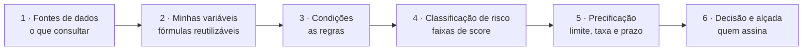

<Note>
**Esta página descreve a Política de Crédito, o conjunto de regras que controla decisões automáticas.** A Política produz o [Score](/concepts/score) durante a análise e usa as faixas de risco para chegar à [Decisão Automática](/concepts/decisao-automatica). Não confundir Política com Score: a Política é o conjunto de regras; o Score é o número final calculado por essas regras.
</Note>

## O que é uma Política de Crédito

Uma **política de crédito** é o conjunto de regras e critérios que define como a GYRA+ avalia um CPF ou CNPJ e chega a uma decisão automática.

Ela responde a três perguntas:
1. **Quais dados consultar?** → Define quais bureaus e integrações serão acionadas
2. **Quais critérios aplicar?** → Define as regras de avaliação (score mínimo, limite de dívida, etc.)
3. **Qual a decisão?** → Define quando aprovar, alertar ou negar

Toda chamada ao `POST /report` exige um `policyId`. Esse ID determina completamente o comportamento da análise.

---

## As seis etapas de uma política

Toda política é montada nas mesmas seis etapas, na ordem em que aparecem no editor. As três primeiras respondem *com o que decidir*; as três últimas, *como decidir*.

<Steps>
  <Step title="Fontes de dados" icon="database">
    De onde vêm os dados que esta política usa. Começa pelo **Relatório base**, que define o tipo de documento (CPF ou CNPJ) e o nível da análise, e a partir dele você liga só as fontes que fizerem sentido. **Esta etapa destrava as outras**: o Relatório base é o que determina quais variáveis existem para escrever regra em cima.
  </Step>
  <Step title="Minhas variáveis" icon="code">
    Fórmulas reutilizáveis criadas por você, referenciadas por `#nome` em qualquer regra, faixa de risco ou fórmula de preço. Serve para escrever uma vez o cálculo que a sua casa repete em toda política.
  </Step>
  <Step title="Condições" icon="filter">
    O coração da política. Cada condição é um conjunto de regras avaliadas sobre os dados coletados, e cada uma aplica um veredito (aprovar, alerta ou negar) ou soma e subtrai pontos.
  </Step>
  <Step title="Classificação de risco" icon="gauge">
    Opcional. Liga a pontuação e define os **ratings por faixa de score, de 0 a 1000**, com o veredito de cada faixa. Sem esta etapa ativa, as condições decidem direto; com ela ativa, a faixa final prevalece sobre o resultado individual das condições.
  </Step>
  <Step title="Precificação" icon="tag">
    Opcional. Fórmulas que sugerem **limite, taxa e prazo** a partir das variáveis do relatório. Ver [Precificação](/concepts/precificacao).
  </Step>
  <Step title="Decisão e alçada" icon="user-check">
    O objetivo da política, se o resultado é aplicado automaticamente ao relatório e quem pode alterar análises. É também onde vive a configuração do [Comitê de Crédito IA](/concepts/comite-de-credito), quando a política tem pipeline de parecer.
  </Step>
</Steps>

<Note>
  Só a primeira etapa é obrigatória. Uma política válida pode ter apenas Relatório base e Condições. Classificação de risco, Precificação e Minhas variáveis existem para quem precisa delas.
</Note>

---

## Fontes de dados

A primeira etapa é uma lista de cartões que você liga ou desliga. Só o que estiver ativo é coletado em runtime, o que significa que **esta tela é também onde você controla custo e latência** da análise.

| Fonte | O que faz |
| ----- | --------- |
| **Relatório base** | Obrigatório. Tipo de documento (CPF ou CNPJ) e nível: **Simples**, **Essencial**, **Completo** ou **Completo+**. Define o conjunto de dados e, por consequência, as variáveis disponíveis. |
| **Bureau de crédito** | Escolha **única** entre os bureaus disponíveis, ou nenhum. Detalhe das opções em [Bureau de Crédito](/sources/bureau-credito#qual-bureau-usar). |
| **SCR, Banco Central** | Endividamento no sistema financeiro. Ver [SCR / Open Finance](/sources/scr-open-finance). |
| **Cenprot** | Protestos em nível nacional, direto da Central Nacional de Protestos, com cobertura mais completa que a do bureau. Fonte adicional. Ver [Protestos](/sources/protestos#como-escolher-a-fonte). |
| **Núclea** | Indicadores baseados em transações reais (antiga CIP), selecionados individualmente. Só PJ. Fonte adicional. Ver [Inteligência de Pagamentos](/sources/inteligencia-pagamentos). |
| **Balanço patrimonial** | Habilita as variáveis de balanço nas condições e fórmulas desta política. Ver [Análise Financeira](/concepts/analise-financeira). |
| **Bases externas** | Dados próprios da sua organização, configurados em *Configurações de integrações*, disponíveis como variáveis. |

<Warning>
  Sem **Relatório base** definido, as demais etapas ficam bloqueadas: não há variáveis para escrever condição, faixa ou fórmula. É sempre o primeiro passo.
</Warning>

<Tip>
  Cenprot e Núclea são **fontes adicionais**, com custo por consulta além do relatório base. Ligue quando o dado for mudar a decisão, não por padrão. As demais fontes acompanham o nível do relatório contratado.
</Tip>

---

## Status possíveis de uma decisão

| Status | Código | Descrição |
|--------|--------|-----------|
| `NOT_EXECUTED` | 0 | Regra não foi avaliada |
| `PENDING` | 1 | Aguardando avaliação |
| `APPROVED` | 3 | Aprovado automaticamente |
| `DENIED` | 4 | Negado automaticamente |
| `ALERT` | 5 | Requer revisão manual |
| `NOT_APPLIED` | 8 | Regra não aplicável ao documento |

Esse é o `policyStatus` retornado em todo relatório. Se ele deve ou não virar o `status` do relatório depende da configuração da política — veja [Status do relatório × Status da política](/concepts/relatorio#status-do-relat%C3%B3rio-status-da-pol%C3%ADtica).

---

## Decisão automática vs. análise manual

Cada política tem a opção **"Usar resultado da política no relatório"**:

- **Ligada:** o resultado da política (`policyStatus`) é aplicado automaticamente ao `status` do relatório. Ideal para fluxos de alto volume (onboarding, checkout, crédito massificado).
- **Desligada:** a política calcula o `policyStatus` como referência, mas o `status` do relatório fica `PENDING` até um analista decidir pela UI do Toolbox ou via [`POST /report/analyze`](/api-reference/report/post-reportanalyze). Ideal para mesa de crédito, due diligence e casos que exigem julgamento humano.

Mesmo com a opção ligada, a análise manual continua possível e sobrescreve o `status` do relatório, preservando o `policyStatus` original para auditoria.

---

## Comitê de Crédito IA na política

Além do motor de regras, cada política define se o relatório vai a [Comitê de Crédito IA](/concepts/comite-de-credito), a deliberação de sete agentes especialistas e um Presidente sobre os pareceres do relatório. A configuração fica no bloco **Comitê de Crédito IA** da edição da política:

| Opção | Comportamento |
| ----- | ------------- |
| **Não convocar automaticamente** | O comitê só roda quando alguém convoca: pelo botão **Convocar Comitê** no relatório, ou por [`POST /report/{id}/committee`](/api-reference/report/post-reportcommittee). É o modo sob demanda. |
| **Convocar comitê e sugerir decisão** | O comitê roda sozinho e sugere a decisão. Aprovar ou negar continua com o analista, pela tela ou por [`POST /report/analyze`](/api-reference/report/post-reportanalyze). |
| **Convocar comitê e decisão automática** | O comitê roda sozinho e aplica a decisão no status do relatório, sem passar por um humano. |

O comitê só é convocado depois que os pareceres por seção e o resultado da política concluem, e depende de a política ter o pipeline de parecer habilitado.

<Note>
  Com **"Usar resultado da política no relatório"** ligado, o comitê só é convocado quando a política **aprova**. Política rejeitada não vai a comitê (o relatório fica com o comitê em `SKIPPED`, e ainda assim pode ser levado a comitê manualmente).
</Note>

Nos planos **Business** e **Enterprise**, a mesma tela permite escrever **instruções adicionais por agente**, com o apetite de risco e os critérios internos da sua instituição. Detalhes em [Comitê de Crédito IA](/concepts/comite-de-credito#instru%C3%A7%C3%B5es-da-sua-institui%C3%A7%C3%A3o-nos-agentes).

---

## Templates disponíveis

A GYRA+ oferece políticas prontas para os cenários mais comuns. Use o `policyId` correspondente ao chamar a API.

| Template | `policyId` | Tipo | Relatório | Uso recomendado |
|----------|------------|------|-----------|-----------------|
| Abertura de Conta | `67be2e43d6c1064a759601bf` | CPF | Essencial | KYC e onboarding de PF |
| Background Check | `679955e0485aa2f033203f98` | CNPJ | Completo | Due diligence de fornecedores |
| Financiamento LP | `67c07e841997d65ab3dc74cd` | CNPJ | Completo | Crédito para empresas |

<Tip>
Você pode usar um template como ponto de partida e personalizar as regras, pesos e faixas de risco pelo painel do Toolbox ou pela API.
</Tip>

---

## Como as regras são combinadas

Cada **condição** dentro de um grupo é formada por uma ou mais regras. As combinações possíveis são:

| Combinação | Comportamento |
|------------|---------------|
| `AND` | **Ambas** as regras devem ser satisfeitas para gerar a ação (`APPROVED`, `ALERT` ou `DENIED`) |
| `OR` | **Uma única** regra satisfeita já gera a ação (`APPROVED`, `ALERT` ou `DENIED`) |

### Score da condição

O score é uma dimensão separada da combinação de regras. Para cada **status final** de uma condição há um valor que é somado ao score acumulado:

- `APPROVED` → soma um valor positivo (ex.: `+30 pts`)
- `ALERT` → soma um valor negativo leve (ex.: `-50 pts`)
- `DENIED` → soma um valor negativo forte (ex.: `-100 pts`)

A política parte de **1000 pts** e, após somar os deltas de todas as condições, gera o **score final**:

- Faixa válida: **1 a 1000 pts**
- Se o total exceder `1000`, mantém-se o limite superior `1000`
- Se ficar abaixo de `1`, mantém-se o limite inferior `1`

A faixa em que o score final cair determina o `statusToApply` configurado em `Risk[]`.

---

## Opções de uso

Você tem três formas de trabalhar com políticas:

<CardGroup cols={3}>
  <Card title="Usar template pronto" icon="bolt">
    Escolha um dos templates da GYRA+ e comece a analisar imediatamente. Ideal para quem está começando.
  </Card>
  <Card title="Personalizar template" icon="sliders">
    Parta de um template existente e ajuste regras, pesos e critérios para a sua estratégia de risco.
  </Card>
  <Card title="Criar do zero" icon="plus">
    Configure uma política completamente nova com suas próprias variáveis, condições e faixas de decisão.
  </Card>
</CardGroup>

Para criar ou editar políticas pelo painel, acesse **Políticas de Decisão** no menu do Toolbox.
Para gerenciar via API, veja a [referência do endpoint de políticas](/api-reference/credit-policypolicy/get-credit-policypolicy).

<Note>
**Regra `Tem mandato`:** disponível para uso em políticas de PF (relatórios COMPLETO e COMPLETO+). Avalia se o CPF possui mandado de prisão ativo no CNJ no mês corrente. Veja detalhes na seção [CRIMINAL_RECORD](/concepts/secoes#an%C3%A1lise-de-risco).
</Note>
