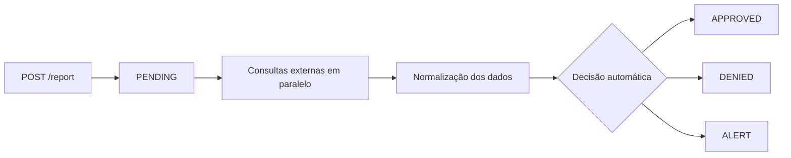

## Visão geral

Um **relatório** é o produto principal da GYRA+. Ele reúne, em um único objeto estruturado, todas as informações relevantes para a análise de crédito de uma pessoa física (CPF) ou jurídica (CNPJ).

Cada relatório é gerado a partir de um CPF ou CNPJ combinado com uma [Política de Crédito](/concepts/politica-de-credito). A política determina quais fontes serão consultadas, quais regras serão aplicadas e qual a decisão final.

---

## Ciclo de vida de um relatório



| Status | Descrição |
|--------|-----------|
| `PENDING` | Relatório criado, consultas em andamento |
| `APPROVED` | Política avaliada, resultado: aprovado |
| `DENIED` | Política avaliada, resultado: negado |
| `ALERT` | Política avaliada, requer revisão manual |

O processamento é **assíncrono**. Após o `POST /report`, você recebe o resultado via [webhook](/concepts/webhooks-e-tempo-real) ou consulta com `GET /report/:id`.

---

## Tipos de relatório

A GYRA+ oferece quatro profundidades de análise, identificadas como **tipos de relatório**. Cada tipo está vinculado à política de crédito utilizada.

| Tipo | Cobertura | Indicado para |
|------|-----------|---------------|
| **SIMPLES** | Cadastral + contatos, mapa e fotos de fachada | Qualificação de leads, higienização de base |
| **ESSENCIAL** | SIMPLES + score + relacionamentos (1º nível) + processos desde 2014 | Crédito de ticket baixo, onboarding rápido |
| **COMPLETO** | ESSENCIAL + PEFIN/REFIN + Bad Check + SCR Bacen + protestos + PEP/Sanções + criminal + certidões (parciais) | Crédito B2B, análise de risco médio |
| **COMPLETO+** | COMPLETO + processos desde 1980 + certidões completas | Grandes operações, due diligence, risco alto |

<Card
  title="Comparativo completo dos relatórios"
  icon="table"
  href="https://go.n8n.gyramais.com.br/webhook/comparativorelatorios"
  arrow={true}
  cta="Ver tabela"
>
  Acesse o comparativo detalhado com todos os campos disponíveis em cada tipo.
</Card>

---

## Estrutura de um relatório

Um relatório é composto por **seções**. Cada seção corresponde a um tema de análise (processos judiciais, protestos, score, etc.) e é gerada de forma independente pelas integrações ativas na política.

```
Report
├── id, document, status, createdAt
├── type (SIMPLES / ESSENCIAL / COMPLETO / COMPLETO+)
├── commentary (análise gerada por IA)
├── policyResult (decisão automática + regras avaliadas)
└── sections[]
    ├── BASIC_INFORMATION
    ├── SUMMARY
    ├── RELATIONS
    ├── PROCESSES
    ├── PROTESTS
    ├── PEFIN / REFIN
    ├── HISTORY / CATEGORIES (SCR)
    ├── PEP / SANCTIONS
    ├── CERTIFICATES
    └── CREDIT_POLICY
```

Veja a documentação completa de cada seção no [Dicionário de Dados](/data/estrutura-relatorio).

---

## Como acessar um relatório

<CodeGroup>

```bash Criar relatório
curl -X POST https://gyra-core.gyramais.com.br/report \
  -H "Authorization: Bearer {token}" \
  -H "Content-Type: application/json" \
  -d '{
    "document": "43591367000130",
    "policyId": "67be2e43d6c1064a759601bf",
    "type": "CNPJ"
  }'
```

```bash Consultar resultado
curl https://gyra-core.gyramais.com.br/report/{id} \
  -H "Authorization: Bearer {token}"
```

</CodeGroup>

<Tip>
Configure um [webhook](/concepts/webhooks-e-tempo-real) para receber a decisão assim que o relatório for concluído, sem precisar fazer polling.
</Tip>
