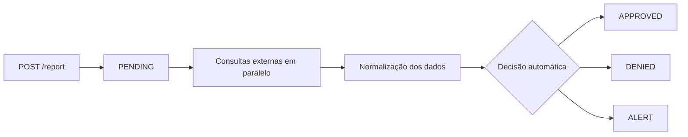

<Note>
**Esta página descreve o Relatório, a análise de crédito de um CPF ou CNPJ individual.** Para criar um relatório na plataforma, ver [Rodar uma Análise](/toolbox/rodar-operacao). Para criar via API, ver [Criar Relatório](/api-reference/report-v2/post-v2report). Não confundir com [Operação](/concepts/operacoes), que é o workflow que pode gerar vários relatórios encadeados.
</Note>

## Visão geral

Um **relatório** é o produto principal da GYRA+. Ele reúne, em um único objeto estruturado, todas as informações relevantes para a análise de crédito de uma pessoa física (CPF) ou jurídica (CNPJ).

Cada relatório é gerado a partir de um CPF ou CNPJ combinado com uma [Política de Crédito](/concepts/politica-de-credito). A política determina quais fontes serão consultadas, quais regras serão aplicadas e qual a decisão final.

### Como criar um relatório

**Na plataforma**: no Toolbox, abra Operações, clique em "Nova operação", informe o CPF ou CNPJ, selecione a política de crédito que define como a análise será feita, escolha o tipo de relatório e confirme. Ver [Rodar uma Análise](/toolbox/rodar-operacao).

**Via API**: enviar `POST /report` com o documento, o `policyId` da política e o tipo. Ver [Criar Relatório](/api-reference/report-v2/post-v2report).

---

## Ciclo de vida de um relatório



| Status | Descrição |
|--------|-----------|
| `PENDING` | Relatório criado, consultas em andamento |
| `APPROVED` | Relatório aprovado |
| `DENIED` | Relatório negado |
| `ALERT` | Relatório requer revisão manual |

O processamento é **assíncrono**. Após o `POST /report`, você recebe o resultado via [webhook](/concepts/webhooks-e-tempo-real) ou consulta com `GET /report/:id`.

---

## Status do relatório × Status da política

O relatório tem **duas dimensões de status**, que costumam ser confundidas:

| Campo | O que representa | Quem altera |
|-------|------------------|-------------|
| `status` (status do relatório) | Decisão final registrada no relatório. É o estado oficial usado para exibir o resultado, disparar webhooks `REPORT_STATUS` e responder a consumidores downstream. | Pode ser definido pela política (automático) **ou** por um analista humano via Toolbox / `POST /report/analyze`. |
| `policyStatus` (status da política) | Resultado da avaliação automática das regras da política de crédito sobre os dados do relatório. | Sempre calculado pela política. |

`policyStatus` **sempre** é calculado, mas ele só vira o `status` do relatório se a política estiver configurada para isso.

### Configuração na política: "Usar resultado da política no relatório"

Cada política de crédito tem a opção **"Usar resultado da política no relatório"**:

- **Ligada (modo automático):** o `policyStatus` é copiado para o `status` do relatório assim que a política é avaliada. O relatório já chega `APPROVED`, `DENIED` ou `ALERT` sem precisar de ação humana.
- **Desligada (modo manual):** a política calcula o `policyStatus` normalmente (e ele fica visível no relatório como referência), mas o `status` do relatório só muda quando um analista decide via UI ou API. Útil quando a política é usada como apoio à mesa de crédito, e não como decisor final.

### Fazendo análise manual

Independentemente do modo da política, é sempre possível sobrescrever ou complementar a decisão:

- **Pelo Toolbox:** abra o relatório, leia o parecer e os indicadores, e use os botões de aprovar/negar com justificativa.
- **Pela API:** use [`POST /report/analyze`](/api-reference/report/post-reportanalyze) para registrar a primeira análise manual e [`POST /report/re-analyze`](/api-reference/report/post-reportre-analyze) para refazê-la se chegar nova informação.

A análise manual altera o `status` do relatório e dispara o webhook `REPORT_STATUS`. O `policyStatus` original é preservado para auditoria — você consegue ver tanto o que a política decidiu quanto o que o analista decidiu.

<Tip>
Use modo automático para fluxos de alto volume (onboarding, checkout) onde a política expressa todo o apetite de risco. Use modo manual quando a decisão exige julgamento humano (mesa de crédito B2B, due diligence, casos sensíveis).
</Tip>

---

## Tipos de relatório

A GYRA+ oferece quatro profundidades de análise, identificadas como **tipos de relatório**. Cada tipo está vinculado à política de crédito utilizada.

| Tipo | Cobertura | Indicado para |
|------|-----------|---------------|
| **SIMPLES** | Cadastral + contatos, relacionamentos de 1º nível, faturamento/renda, mapa e fotos de fachada | Qualificação de leads, higienização de base |
| **ESSENCIAL** | SIMPLES + relacionamentos (até 3º nível, parentesco, filiais e empresas no mesmo endereço) + processos jurídicos desde 2014 + alterações cadastrais | Crédito de ticket baixo, onboarding rápido |
| **COMPLETO** | ESSENCIAL + PEP + sanções + certidões (PGFN, Receita, IBAMA, TST, CNJ, MTE, SEFAZ, FGTS, antecedente criminal) | Crédito B2B, análise de risco médio |
| **COMPLETO+** | COMPLETO + processos jurídicos desde 1980 + licenças operacionais de nicho (ANTT, ANATEL, ANVISA, ANP) + beneficiário social (programas do governo) | Grandes operações, due diligence, risco alto |

### Dados adicionais por relatório

Para cada tipo de relatório é possível adicionar dados complementares:

| Adicional | O que inclui |
|-----------|--------------|
| **Bureaus** | Pefin/Refin, protestos, CCF, dívidas vencidas, score, limite, quantidade de consultas e faturamento/renda presumidos |
| **SCR** | Endividamento por faixa e produtos, limites e relacionamentos bancários |
| **Balanço Patrimonial e DRE** | Score, limites, indicadores, extração de dados e análise qualitativa |

<Card
  title="Comparativo completo dos relatórios"
  icon="table"
  href="https://go.n8n.gyramais.com.br/webhook/comparativorelatorios"
  arrow={true}
  cta="Ver tabela"
>
  Acesse o comparativo detalhado com todos os campos disponíveis em cada tipo.
</Card>

---

## Estrutura de um relatório

Um relatório é composto por **seções**. Cada seção corresponde a um tema de análise (processos judiciais, protestos, score, etc.) e é gerada de forma independente pelas integrações ativas na política.

```
Report
├── id, document, status, createdAt
├── type (SIMPLES / ESSENCIAL / COMPLETO / COMPLETO+)
├── commentary (análise gerada por IA)
├── policyResult (decisão automática + regras avaliadas)
└── sections[]
    ├── BASIC_INFORMATION
    ├── SUMMARY
    ├── RELATIONS
    ├── PROCESSES
    ├── PROTESTS
    ├── PEFIN / REFIN
    ├── HISTORY / CATEGORIES (SCR)
    ├── PEP / SANCTIONS
    ├── CERTIFICATES
    └── CREDIT_POLICY
```

Veja a documentação completa de cada seção no [Dicionário de Dados](/data/estrutura-relatorio).

---

## Como acessar um relatório

<CodeGroup>

```bash Criar relatório
curl -X POST https://gyra-core.gyramais.com.br/report \
  -H "Authorization: Bearer {token}" \
  -H "Content-Type: application/json" \
  -d '{
    "document": "43591367000130",
    "policyId": "67be2e43d6c1064a759601bf",
    "type": "CNPJ"
  }'
```

```bash Consultar resultado
curl https://gyra-core.gyramais.com.br/report/{id} \
  -H "Authorization: Bearer {token}"
```

</CodeGroup>

<Tip>
Configure um [webhook](/concepts/webhooks-e-tempo-real) para receber a decisão assim que o relatório for concluído, sem precisar fazer polling.
</Tip>
