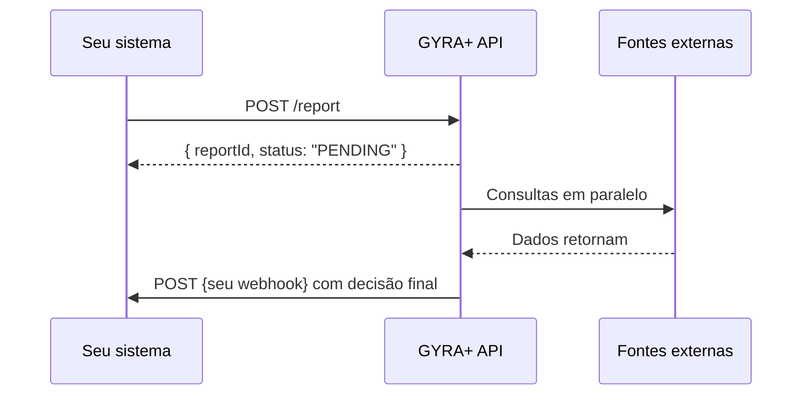

## Por que usar webhooks

O processamento de um relatório GYRA+ é assíncrono, consultas a bureaus de crédito, SCR/Open Finance e certidões levam tempo. Em vez de consultar `GET /report/:id` repetidamente, configure um webhook para receber o resultado **assim que estiver pronto**.

Isso é a base de qualquer integração robusta com a GYRA+.

---

## Como funciona



1. Você cria o relatório com `POST /report`
2. Recebe imediatamente o `reportId` e o status `PENDING`
3. A GYRA+ processa em background
4. Quando concluído, envia um `POST` para a URL do seu webhook com o resultado completo

---

## Tipos de evento

Cada webhook é registrado para **um único tipo** de evento. Para escutar mais de um, registre webhooks separados.

| Tipo | Quando dispara |
| ---- | -------------- |
| `REPORT` | A cada seção do relatório concluída durante o processamento (granular). |
| `REPORT_FINISHED` | Relatório totalmente processado e finalizado. |
| `REPORT_STATUS` | Analista aprovou ou rejeitou manualmente o relatório. |
| `REPORT_EXPORTED` | Exportação (PDF/XLS) do relatório foi gerada (ou falhou). |
| `CREDIT_POLICY` | Política de crédito foi avaliada e o status mudou. |
| `OPERATION` | Operação (fluxo multi-relatório) concluiu com status final. |

## Payload do webhook

Todo disparo é um `POST` com envelope:

```json
{
  "organizationId": "64a3b2c1d4e5f6a7b8c9d0e1",
  "webhookType": "REPORT_FINISHED",
  "data": { ... }
}
```

O conteúdo de `data` depende do tipo. Exemplo para `REPORT_FINISHED`:

```json
{
  "content": {
    "reportId": "64a3b2c1d4e5f6a7b8c9d0e1",
    "policyId": "6612a7f30000000000000010",
    "isFinalized": true,
    "finalizedAt": "2025-03-01T10:30:45.000Z",
    "errors": { "sections": ["PROCESSES"] }
  },
  "compress": false
}
```

Estrutura de `data` para os demais tipos e exemplos completos em [Webhooks e API Keys](/toolbox/webhooks-e-api-keys#estrutura-do-payload).

---

## Configurando um webhook

<Steps>
  <Step title="Crie o endpoint no seu sistema">
    O endpoint deve estar acessível publicamente e responder `HTTP 200` para confirmar o recebimento.
  </Step>
  <Step title="Registre a URL na GYRA+">
    ```bash
    curl -X POST https://gyra-core.gyramais.com.br/webhook \
      -H "Authorization: Bearer {token}" \
      -H "Content-Type: application/json" \
      -d '{
        "type": "REPORT_FINISHED",
        "url": "https://seu-sistema.com/webhooks/gyra"
      }'
    ```

    Um webhook por `type`. Para escutar múltiplos eventos, registre um por tipo.
  </Step>
  <Step title="Teste o recebimento">
    Crie um relatório de teste e valide que o payload chegou corretamente no seu endpoint.
  </Step>
</Steps>

---

## Boas práticas

<AccordionGroup>
  <Accordion title="Responda 200 imediatamente">
    Seu endpoint de webhook deve responder `HTTP 200` o mais rápido possível, antes de qualquer processamento pesado. Processe o payload de forma assíncrona na sua fila interna.
  </Accordion>
  <Accordion title="Use o externalId para rastrear">
    Ao criar o relatório, passe o `externalId` com o identificador do seu sistema (ID do pedido, ID do cliente, etc.). O webhook retornará esse campo, facilitando o vínculo com sua base de dados.
  </Accordion>
  <Accordion title="Valide o payload antes de processar">
    Verifique os campos `status` e `policyStatus` antes de tomar qualquer ação no seu sistema. Um `status: APPROVED` com `policyStatus: ALERT` pode ter tratamento diferente.
  </Accordion>
  <Accordion title="Tenha fallback com polling">
    Em caso de indisponibilidade temporária do seu endpoint, implemente um fallback com `GET /report/:id` para não perder resultados.
  </Accordion>
</AccordionGroup>

---

## Retry

A GYRA+ tenta entregar cada evento até **3 vezes** com backoff exponencial (1s, ~2s, ~5s). Se o seu endpoint retornar `429` com `Retry-After`, a GYRA+ respeita esse tempo. Após as tentativas, o evento é descartado — mantenha fallback com polling em `GET /v2/report/:id` para eventuais perdas e planeje idempotência no seu lado.
