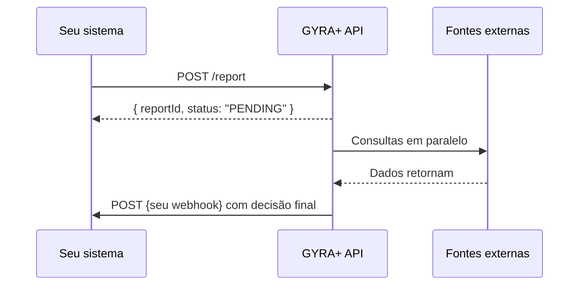

## Por que usar webhooks

O processamento de um relatório GYRA+ é assíncrono, consultas a bureaus de crédito, SCR/Open Finance e certidões levam tempo. Em vez de consultar `GET /report/:id` repetidamente, configure um webhook para receber o resultado **assim que estiver pronto**.

Isso é a base de qualquer integração robusta com a GYRA+.

---

## Como funciona



1. Você cria o relatório com `POST /report`
2. Recebe imediatamente o `reportId` e o status `PENDING`
3. A GYRA+ processa em background
4. Quando concluído, envia um `POST` para a URL do seu webhook com o resultado completo

---

## Payload do webhook

Quando o relatório é concluído, a GYRA+ envia um `POST` para sua URL com o seguinte payload:

```json
{
  "reportId": "64a3b2c1d4e5f6a7b8c9d0e1",
  "document": "43591367000130",
  "type": "CNPJ",
  "status": "APPROVED",
  "policyStatus": "APPROVED",
  "score": 720,
  "externalId": "pedido-123",
  "createdAt": "2025-03-01T10:30:00.000Z",
  "completedAt": "2025-03-01T10:30:45.000Z"
}
```

| Campo | Tipo | Descrição |
|-------|------|-----------|
| `reportId` | string | ID do relatório na GYRA+ |
| `document` | string | CPF ou CNPJ consultado |
| `type` | string | `CPF` ou `CNPJ` |
| `status` | string | Status geral: `APPROVED`, `DENIED`, `ALERT` |
| `policyStatus` | string | Resultado da política de crédito |
| `score` | number | Score final (0–1000) |
| `externalId` | string | Identificador do seu sistema (se enviado no `POST /report`) |

---

## Configurando um webhook

<Steps>
  <Step title="Crie o endpoint no seu sistema">
    O endpoint deve estar acessível publicamente e responder `HTTP 200` para confirmar o recebimento.
  </Step>
  <Step title="Registre a URL na GYRA+">
    ```bash
    curl -X POST https://gyra-core.gyramais.com.br/webhook \
      -H "Authorization: Bearer {token}" \
      -H "Content-Type: application/json" \
      -d '{
        "url": "https://seu-sistema.com/webhooks/gyra",
        "events": ["report.completed"]
      }'
    ```
  </Step>
  <Step title="Teste o recebimento">
    Crie um relatório de teste e valide que o payload chegou corretamente no seu endpoint.
  </Step>
</Steps>

---

## Boas práticas

<AccordionGroup>
  <Accordion title="Responda 200 imediatamente">
    Seu endpoint de webhook deve responder `HTTP 200` o mais rápido possível, antes de qualquer processamento pesado. Processe o payload de forma assíncrona na sua fila interna.
  </Accordion>
  <Accordion title="Use o externalId para rastrear">
    Ao criar o relatório, passe o `externalId` com o identificador do seu sistema (ID do pedido, ID do cliente, etc.). O webhook retornará esse campo, facilitando o vínculo com sua base de dados.
  </Accordion>
  <Accordion title="Valide o payload antes de processar">
    Verifique os campos `status` e `policyStatus` antes de tomar qualquer ação no seu sistema. Um `status: APPROVED` com `policyStatus: ALERT` pode ter tratamento diferente.
  </Accordion>
  <Accordion title="Tenha fallback com polling">
    Em caso de indisponibilidade temporária do seu endpoint, implemente um fallback com `GET /report/:id` para não perder resultados.
  </Accordion>
</AccordionGroup>

---

## Referência de eventos

| Evento | Descrição |
|--------|-----------|
| `report.completed` | Relatório concluído (aprovado, negado ou alerta) |

<Note>
Mais eventos serão adicionados em versões futuras da API. Acompanhe o [Changelog](/reference/changelog) para novidades.
</Note>
