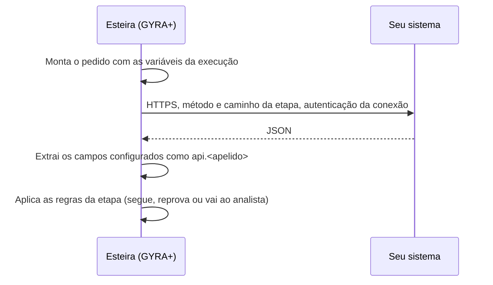

A Chamada de API deixa a esteira perguntar ao seu sistema no meio da análise ou da formalização, e decidir com a resposta, sem código do seu lado para orquestrar o fluxo.

<Info>
  **Resumo:** o seu time cadastra uma **conexão** (URL base e autenticação). Na esteira, a etapa escolhe a conexão, monta o pedido com variáveis da execução e diz quais campos da resposta usar. Cada campo vira `api.<apelido>` para as etapas seguintes. Esta página é para quem vai expor o endpoint que a GYRA+ chama.
</Info>

A etapa está disponível para todas as organizações, sem módulo à parte.

## Como funciona

A chamada sai de dentro da execução, de forma assíncrona. A execução espera a resposta e continua sozinha.

## A conexão

A conexão guarda o que é fixo e secreto. Ela é cadastrada em **Configurações**, **Integrações**, **Conexões de API** (veja [Integrações](/toolbox/integracoes)).

| Campo | O que é |
| --- | --- |
| **Nome da conexão** | Como a conexão aparece no construtor |
| **URL base** | Por exemplo `https://api.suaempresa.com.br`. A etapa acrescenta só o caminho. |
| **Autenticação** | Um dos sete tipos abaixo |
| Headers fixos | Enviados em toda chamada da conexão |
| **Caminho de teste (GET)** | Usado para testar a conexão ao salvar |

Chaves, senhas, certificados e tokens ficam cifrados e nunca voltam para a tela. Nos registros da chamada, os segredos aparecem mascarados.

### Autenticação

| Tipo na tela | O que a GYRA+ envia |
| --- | --- |
| **Nenhuma** | Só os headers fixos da conexão |
| **Bearer** | `Authorization: Bearer <token>` com um token fixo |
| **Basic** | `Authorization: Basic <base64 de usuário:senha>` |
| **Chave de API** | A chave num header ou num parâmetro de query, com o nome que você definir |
| **OAuth2** | Client credentials: a GYRA+ pede o token na URL de token (com `client_id` e `client_secret` no corpo ou em Basic, e `scope`/`audience` opcionais) e envia `Authorization: Bearer <token>` |
| **mTLS** | Certificado de cliente `.pfx`, com senha opcional |
| **HMAC** | Assinatura da requisição, descrita abaixo |

<Accordion title="Como validar a assinatura HMAC">
  A GYRA+ calcula um HMAC em hexadecimal, com SHA-256 ou SHA-512, usando o segredo da conexão, e envia no header que você configurar. Há dois formatos de conteúdo assinado:

  - **Corpo**: assina o corpo cru da requisição (texto vazio quando não há corpo).
  - **Método, caminho, corpo e horário**: assina `METODO\n/caminho?query\ncorpo\ntimestamp`, com o timestamp em segundos (epoch). O timestamp vai num header próprio, por padrão `X-Timestamp`.

  Do seu lado, recalcule com o mesmo segredo e compare. No segundo formato, recuse timestamps muito antigos para evitar reenvio malicioso.
</Accordion>

### Proteções sempre ligadas

- A URL base da conexão começa com `https://`: "A URL base precisa ser https://. Chamada sem criptografia não sai da Gyra."
- Redirecionamentos são seguidos. Se o redirecionamento leva a outro endereço (protocolo, host ou porta diferentes), a GYRA+ não repassa a autenticação nem os headers da conexão.
- A resposta pode ter até 2 MB.
- Segredos mascarados nos registros.

## O pedido

A etapa define método, caminho, parâmetros, headers e corpo.

| Parte | Regra |
| --- | --- |
| Método | `GET`, `POST`, `PUT`, `PATCH` ou `DELETE` (padrão `GET`) |
| Caminho | Começa com `/` e é somado à URL base. Ex.: `/v1/clientes/{{emitente.cnpj}}/limite` |
| Parâmetros | Pares nome e valor na query |
| Headers | Pares nome e valor. `Authorization`, `Cookie`, `Host`, `Content-Length`, `Transfer-Encoding` e `Connection` são reservados: a autenticação vem da conexão. |
| Corpo | JSON, só em `POST`, `PUT` e `PATCH` |

Quando há corpo JSON e você não define `Content-Type`, a GYRA+ envia `application/json`. Sem `Accept` definido, envia `Accept: application/json`.

### Variáveis no pedido

Escreva `{{nome}}` no caminho, na query, nos headers ou no corpo. No caminho, o valor é codificado para URL. No corpo, entra como valor JSON válido.

| Variável | Valor |
| --- | --- |
| `documento`, `emitente.documento` | CPF ou CNPJ da execução, só letras e números (o CNPJ alfanumérico mantém as letras) |
| `emitente.cnpj` | O mesmo documento, quando é um CNPJ |
| `emitente.cpf` | O mesmo documento, quando é um CPF |
| `proposta.id` | Id da proposta, quando a execução tem proposta |
| `execucao.id` | Id da execução |

Além dessas, vale qualquer variável da esteira: dados da proposta, [dados de entrada](/esteiras/dados-de-entrada), resultados de etapas anteriores e respostas de chamadas anteriores.

**Variável sem valor não vira campo vazio.** Se uma variável do pedido não tem valor na hora, a GYRA+ não chama o seu sistema e a etapa para com o motivo: "Variável X sem valor".

<Tip>
  Use `{{execucao.id}}` como chave de idempotência. Uma falha transitória pode fazer a GYRA+ repetir o mesmo pedido.
</Tip>

## A resposta

A resposta precisa ser JSON para a etapa extrair campos. Cada campo configurado tem:

| Campo | O que é |
| --- | --- |
| Caminho | JSONPath começando com `$`. Ex.: `$.data.limite` |
| Nome | O apelido. Vira `api.<apelido>`. Até 64 caracteres; `httpStatus` é reservado. |
| Tipo | **Número**, **Texto**, **Sim ou não** ou **Data** |
| **Obrigatória** | Se marcada e o campo não vier, a etapa vai para o analista |

A conversão aceita formatos comuns:

| Tipo | Aceita | Na fórmula |
| --- | --- | --- |
| Número | `1234.56`, `"1234.56"`, `"1.234,56"` | O número |
| Texto | Texto, número ou booleano | O texto |
| Sim ou não | `true`/`false`, `1`/`0`, `"sim"`/`"não"`, `"s"`/`"n"`, `"yes"`/`"no"` | `1` ou `0` |
| Data | `"AAAA-MM-DD"` (com ou sem hora), `"dd/mm/aaaa"`, epoch em segundos ou milissegundos | Número de data; o texto `AAAA-MM-DD` fica em `api.<apelido>_texto` |

Valor que não converte para o tipo conta como ausente.

### Onde a resposta é usada

As variáveis `api.<apelido>` ficam disponíveis para as etapas **seguintes**: a condição **Executar quando**, as fórmulas da Decisão, o contrato e outras chamadas de API. Uma etapa não enxerga a resposta de uma chamada que vem depois dela.

## A decisão da etapa

As regras são opcionais. Sem regra, a etapa só busca os dados e segue.

| Regra | Efeito quando verdadeira |
| --- | --- |
| **Reprovar se** | Reprova. Ex.: `api.tem_restricao = 1`. Na formalização, marca a formalização como não concluída. |
| **Mandar para o analista se** | Para e espera um analista |

A ordem de avaliação:

1. Seu sistema recusou o pedido (`4xx`): analista. "O sistema chamado recusou o pedido. Veja a resposta, corrija e reenvie, ou decida."
2. A chamada não foi concluída: analista. "A chamada de API não foi concluída (tempo esgotado, rede ou erro no sistema chamado). Reenvie ou decida."
3. Falta um campo obrigatório: analista. "A resposta da API veio sem "X", que é uma saída obrigatória."
4. **Reprovar se** verdadeiro: reprova.
5. **Mandar para o analista se** verdadeiro: analista.
6. Regra que não pode ser calculada: analista, com o motivo.
7. Nenhuma das anteriores: segue.

## Tempo, falhas e novas tentativas

| Situação | O que acontece |
| --- | --- |
| Resposta `2xx` | Campos extraídos e regras aplicadas |
| `4xx` (exceto `408` e `429`) | Sem nova tentativa. Vai ao analista com a resposta resumida. |
| `5xx`, `408`, `429`, tempo esgotado ou falha de rede | Nova tentativa automática, até 3 vezes, com intervalos crescentes (a partir de 1, 5 e 15 minutos). Esgotadas, vai ao analista. |
| Resposta acima de 2 MB, redirecionamentos demais ou `3xx` sem destino | Falha, vai ao analista |

- **Limite de tempo** de cada chamada: de 1 a 30 segundos, padrão 15. A tela oferece 5, 10, 15 ou 30 segundos.
- **Se a API falhar**: quanto tempo a etapa espera uma resposta final antes de ir ao analista. A tela oferece 1, 4, 24 ou 72 horas (padrão 72, máximo 720).
- Na página da execução, o analista pode **Reenviar** ("Chamar a API de novo?") depois de corrigir o que for preciso, ou decidir a etapa.

## Testar antes de ativar

No construtor, **Testar com uma proposta** faz a chamada de verdade com a etapa salva e mostra **Requisição enviada**, **Resposta** e **Variáveis extraídas**. Segredos aparecem mascarados e nada é gravado na proposta. Clique numa chave da resposta para criar o campo de saída.

Para ativar a esteira, a etapa precisa de conexão, método e caminho.

## Checklist para o seu endpoint

<Steps>
  <Step title="Exponha em HTTPS">
    Com certificado válido. Se precisar redirecionar, mantenha o mesmo endereço: para outro host, a autenticação não segue.
  </Step>
  <Step title="Escolha a autenticação">
    Crie a credencial e passe para quem cadastra a conexão na GYRA+.
  </Step>
  <Step title="Responda JSON rápido">
    Dentro do limite de tempo configurado (15 segundos por padrão) e com até 2 MB.
  </Step>
  <Step title="Use 4xx só para recusa definitiva">
    `4xx` vai direto ao analista. Para indisponibilidade momentânea, use `503` ou `429`: a GYRA+ tenta de novo.
  </Step>
  <Step title="Trate repetição">
    Use `{{execucao.id}}` ou `{{proposta.id}}` para reconhecer um pedido repetido.
  </Step>
</Steps>

## Próximos passos

<CardGroup cols={2}>
  <Card title="Integrações" icon="plug" href="/toolbox/integracoes">
    Cadastrar a conexão de API na tela.
  </Card>
  <Card title="Etapas" icon="list-ol" href="/esteiras/etapas#integração">
    A etapa Integração no catálogo.
  </Card>
</CardGroup>
