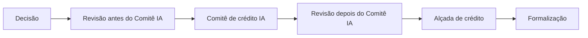

A etapa **Decisão** é onde a esteira responde "aprovamos, em que condições e quem precisa concordar", com a mesma regra para todo pedido.

<Info>
  **Resumo:** a Decisão escolhe uma rota para cada resultado (aprovar sozinha, recusar sozinha ou mandar revisar), define quem revisa e monta a oferta. Depois dela podem vir, nesta ordem, Revisão da oferta, Comitê de crédito IA, outra Revisão e Alçada de crédito.
</Info>

## O bloco de decisão

Todas as etapas depois da Decisão são opcionais. No construtor, você as liga **dentro** da Decisão: Revisão da oferta, Comitê e Alçada saem da lista de etapas avulsas quando a Decisão existe. Ao salvar a Decisão, a tela mostra **O que muda na esteira ao salvar** e pede confirmação em **Confirmar mudanças na esteira**, com as etapas que entram (**Nova etapa**), mudam (**Muda**) ou saem (**Sai da esteira**).

Dentro do bloco, quem decide se o Comitê e a Alçada rodam é a rota do resultado, e não a condição **Executar quando** de cada etapa.

## Rota por resultado

A Decisão olha o **pior resultado entre as etapas e os grupos de vínculos** da execução e escolhe a rota:

| Resultado | Opções | Padrão |
| --- | --- | --- |
| **Aprovado** | **Aprovar automaticamente** ou **Enviar para revisão** | Aprovar automaticamente |
| **Alerta** | **Aprovar automaticamente** ou **Enviar para revisão** | Enviar para revisão |
| **Alerta severo** | **Recusar automaticamente** ou **Enviar para revisão** | Enviar para revisão |

### Quem revisa

| Opção | O que acontece |
| --- | --- |
| **Analista** | Um analista decide na página da execução |
| **Comitê IA sugere** | O Comitê de crédito IA delibera e recomenda; a decisão continua com as pessoas |
| **Comitê IA decide** | O Comitê de crédito IA delibera e a decisão dele vale |

As duas opções com Comitê exigem a etapa Comitê de crédito IA ligada na esteira.

### Configurações por condição

Uma esteira pode tratar casos diferentes de jeitos diferentes, sem duplicar a esteira. Em **Configurações por condição**, cada configuração tem:

| Campo | O que é |
| --- | --- |
| **Nome** | Por exemplo, "Investimento" |
| **Quando** | Uma fórmula, como `produto = "INV"`. Os botões de produto preenchem a condição para você. |
| **Aprovado**, **Alerta**, **Alerta severo** | A rota desta condição, ou **Igual à padrão** |
| **Quem revisa** | **Analista**, **Comitê IA sugere**, **Comitê IA decide** ou **Igual à padrão** |
| **Analistas da revisão** e **Quem revisa a oferta** | Quem decide nesta condição |

A primeira condição verdadeira vale; o que ela não troca segue a configuração padrão. O Comitê IA é uma etapa só, então ele tem o mesmo papel em todas as configurações.

## A oferta

Com **Gerar oferta**, a Decisão monta a oferta com três valores, cada um em **Valor fixo** ou **Fórmula**:

| Campo | Exemplo de fórmula |
| --- | --- |
| **Limite aprovado** | `MIN(valor_pedido, LIMITE_SUGERIDO)` |
| **Taxa mensal** | `TAXA_SUGERIDA` |
| **Prazo (meses)** | `prazo_pedido` |

As fórmulas podem usar a precificação da política (`LIMITE_SUGERIDO`, `TAXA_SUGERIDA`, `PRAZO_SUGERIDO`), os dados da proposta, a escolha do cliente na [pré-aprovação](/propostas/pre-aprovacao-e-oferta), os [dados de entrada](/esteiras/dados-de-entrada) e as respostas de uma [Chamada de API](/esteiras/chamada-de-api). Veja também [Precificação](/concepts/precificacao).

A **Condição extra** é opcional: uma fórmula que a oferta precisa atender. Se não atender, você escolhe entre **aprovar sem oferta** ou **enviar para revisão**.

## Revisão da oferta

Um analista confirma ou ajusta a oferta antes da aprovação. A Revisão pode vir antes do Comitê IA, depois dele, ou nos dois lugares.

- O painel mostra "Ajuste limite, taxa e prazo se precisar. Mudar um valor exige motivo."
- Com Comitê antes, aparece a **Sugestão do Comitê IA**, com **Usar sugestão**.
- Os botões são **Confirmar oferta** e **Recusar oferta**.
- Mudar um valor sem motivo é recusado: "Justifique os ajustes feitos na oferta".

## Comitê de crédito IA

O [Comitê de crédito IA](/concepts/comite-de-credito) reúne os relatórios de todas as Análises, camadas e Vínculos anteriores, com o papel de cada um (o tomador ou uma parte relacionada), os pareceres e a oferta proposta, e delibera.

| Configuração | Opções |
| --- | --- |
| **Papel do Comitê IA** | **Comitê IA recomenda, Alçada decide** ou **Comitê IA decide**. Com a Decisão montada, isso é definido em **Quem revisa**. |
| Objetivo | Opcional. O que o comitê deve priorizar nesta esteira. |
| **Orientações por agente** | Opcional. Soma às regras da organização. |

- O comitê só delibera quando todos os relatórios que ele vai ler estão prontos.
- Exige pelo menos uma política anterior com Parecer IA. O Parecer IA é habilitado pela GYRA+ por política ou pelo nível do relatório; você não liga nem desliga na política.
- Se o comitê não puder ser convocado, a revisão vai para o analista, e a execução não fica parada.
- Na página da execução, a recomendação aparece como "Comitê de IA recomenda aprovar", "aprovar com ressalvas", "levar à alçada" ou "recusar", com a posição de cada agente (**Concorda**, **Concorda com ressalva**, **Diverge**).
- Quando o comitê termina, sua organização pode receber o webhook `COMMITTEE_FINISHED`. Veja [Criar webhook](/api-reference/webhook/post-webhook).

## Alçada de crédito

A alçada leva a oferta às pessoas certas, conforme o valor ou uma regra, e espera o quórum.

### Como escolher a alçada

| Modo | Como escolhe |
| --- | --- |
| **Alçada fixa** | Sempre o mesmo grupo de aprovadores |
| **Por valor** | Pela faixa de valor da oferta: **A partir de** e **Até, sem incluir** |
| **Regras avançadas** | Por valor, score final, decisão ou recomendação do Comitê IA, ou fórmula, com uma alçada de reserva quando nenhuma regra vale |

O valor que escolhe a faixa é, por padrão, o da oferta final (depois das revisões).

Cada faixa tem **Nome da alçada**, **Quem pode aprovar** e **Quórum de aprovações** (padrão 1). Use **Testar encaminhamento** para conferir a alçada antes de ativar a esteira.

Se a esteira não gera oferta, não há valor para escolher a faixa: "A esteira não gera oferta, então não há valor para escolher a alçada. Use Alçada fixa ou ative a oferta na etapa Decisão."

### Como os aprovadores votam

<Steps>
  <Step title="O aprovador é avisado">
    Cada aprovador da faixa recebe o e-mail **Aprovação pendente**, com o documento e o limite proposto, e os botões **Abrir execução** e, quando há proposta, **Ver proposta**. A oferta também aparece na aba **Minhas aprovações**.
  </Step>
  <Step title="O aprovador decide">
    **Aprovar**, **Aprovar com condição** ou **Recusar**. Os atalhos de teclado são `a`, `c` e `r`.
  </Step>
  <Step title="O quórum fecha a alçada">
    A tela mostra "N de M necessárias" e "Falta N aprovação para liberar a oferta." até o quórum ser atingido.
  </Step>
</Steps>

Regras do voto:

- **Uma recusa é veto.** Basta um voto de recusa para recusar a oferta.
- **Recusar exige comentário**: "O comentário é obrigatório para reprovar".
- **Aprovar com condição** só existe na alçada e só ao aprovar. A condição tem de 10 a 1000 caracteres e fica registrada na auditoria.
- **Retirar voto** desfaz o seu voto enquanto a alçada está aberta.
- **Lembrar** reenvia o aviso a um aprovador que ainda não votou, no máximo a cada 30 minutos.
- Quem não está na faixa não vota: "Você não faz parte da alçada responsável por esta oferta".

## Decisão final e oferta final

Ao fim do bloco, a execução registra:

| Registro | Valores |
| --- | --- |
| Decisão final | Aprovado, Alerta ou Reprovado |
| Score final | O score que valeu para a decisão |
| Oferta final | Limite, taxa e prazo depois das revisões |
| Onde foi decidido | A etapa e a política que decidiram |

Alerta aprovado conta como aprovação: a execução recebe o selo **aprovada** e a formalização pode rodar. Quando a execução tem proposta, a oferta final vira a oferta firme da proposta. Veja [Pré-aprovação e oferta](/propostas/pre-aprovacao-e-oferta).

## Próximos passos

<CardGroup cols={2}>
  <Card title="Execuções" icon="play" href="/esteiras/execucoes">
    Onde a decisão, os votos e a auditoria aparecem.
  </Card>
  <Card title="Formalização" icon="file-contract" href="/formalizacao/visao-geral">
    O que acontece depois da aprovação.
  </Card>
</CardGroup>
