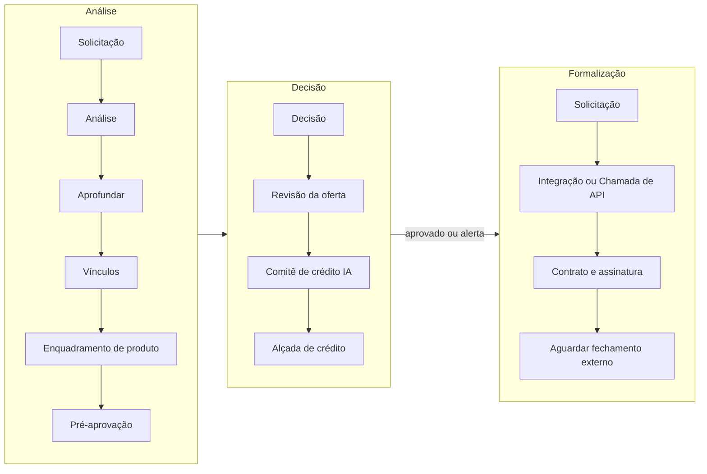

Uma esteira é o caminho que um pedido de crédito percorre na sua organização: quais análises rodam, quem decide, que oferta sai e como o contrato é assinado, sempre na mesma ordem e com cada passo registrado.

<Info>
  **Resumo:** você monta a esteira uma vez, etapa por etapa, e a ativa. Cada rodada dela é uma **execução**, que segue exatamente a versão da esteira com que começou. A esteira tem três fases: análise, decisão e formalização.
</Info>

<Note>
  Até pouco tempo, este recurso se chamava **Operações** e servia para encadear relatórios de sócios, filiais e vínculos. Esse encadeamento continua existindo, agora como a etapa **Vínculos**. Se você vem do modelo antigo, veja a seção **O que mudou para quem usava Operações**, no fim desta página.
</Note>

## O que uma esteira faz

Numa esteira só, você combina o que antes pedia planilha, e-mail e retrabalho:

| Você quer | Etapa |
| --- | --- |
| Pedir formulário e documentos ao cliente, ao titular, aos sócios ou a cada vínculo | **Solicitação** |
| Rodar mais de uma política, uma depois da outra, e aprofundar só para quem passou | **Análise**, **Aprofundar** e **Vínculos** |
| Escolher o produto da proposta por regra, fórmula ou analista | **Enquadramento de produto** |
| Oferecer uma faixa pré-aprovada para o cliente escolher | **Pré-aprovação** |
| Decidir com analista, Comitê de crédito IA, alçada de aprovadores, ou uma combinação deles | **Decisão**, **Revisão da oferta**, **Comitê de crédito IA** e **Alçada de crédito** |
| Gerar o contrato e colher as assinaturas pela Assinatura Gyra ou pela sua conta Clicksign | **Contrato e assinatura** |
| Consultar o seu sistema ou o BNDES Online | **Integração** |

## Esteira e execução

São duas coisas diferentes, e a tela separa as duas em abas.

| | Esteira | Execução |
| --- | --- | --- |
| O que é | A definição: a lista ordenada de etapas | Uma rodada da esteira para um CPF ou CNPJ |
| Quem cria | Quem tem permissão para montar esteiras | O operador, ou uma proposta |
| Muda com o tempo? | Sim, a cada **Salvar** nasce uma versão nova | Não, roda a versão em que começou até o fim |
| Onde fica no toolbox | **Esteiras**, aba **Esteiras** | **Esteiras**, aba **Execuções** |

Uma esteira analisa sempre o mesmo tipo de documento, CPF ou CNPJ. Você escolhe o tipo ao criar a esteira, e as políticas das etapas precisam ser do mesmo tipo. Para trocar o tipo depois, as políticas das etapas têm que ser trocadas antes: "A esteira não pode passar a analisar CPF: a política "X" da etapa "Y" analisa CNPJ. Troque a política antes."

## As três fases

O diagrama mostra uma ordem possível, não uma esteira obrigatória. A primeira etapa é uma das que rodam só com o documento, a proposta e os dados de entrada: **Análise**, **Checkpoint**, **Solicitação**, **Integração** ou **Enquadramento de produto**. Assim a esteira pode começar pedindo o formulário ao cliente, ou escolhendo o produto, antes de qualquer consulta. Todas as outras etapas são opcionais.

<CardGroup cols={3}>
  <Card title="Análise" icon="magnifying-glass">
    Pede o que falta ao cliente, gera o relatório, aplica as políticas, aprofunda dados, analisa vínculos, escolhe o produto e calcula a faixa pré-aprovada.
  </Card>
  <Card title="Decisão" icon="gavel">
    Consolida o resultado, define a rota de cada desfecho e a oferta, e passa por revisão, Comitê IA e alçada quando você quiser.
  </Card>
  <Card title="Formalização" icon="file-signature">
    Só roda com o crédito aprovado. Gera o contrato, colhe as assinaturas e conversa com o BNDES e com o seu sistema.
  </Card>
</CardGroup>

A formalização nunca reescreve a decisão de crédito. Se o contrato não sai (assinatura recusada, prazo vencido, BNDES rejeitou), a execução continua com o selo da decisão, e o desfecho do contrato fica registrado à parte. Detalhes em [Formalização](/formalizacao/visao-geral).

## Anatomia de uma etapa

Toda etapa tem quatro coisas:

| Parte | O que define |
| --- | --- |
| **Tipo** | O que a etapa faz. São 14 tipos, descritos em [Etapas](/esteiras/etapas). |
| **Nome** | Opcional. Sem nome, a etapa usa o nome do tipo. |
| **Executar quando** | A condição para a etapa rodar: **Sempre**, **Se aprovado**, **Se aprovado ou alerta**, **Se alerta severo**, **Por produto** ou **Personalizada** (uma fórmula). |
| **Configuração** | O que é próprio do tipo: a política, o modelo de solicitação, a faixa de oferta, os aprovadores, a chamada ao seu sistema. |

A condição olha a **última decisão registrada na execução**, não só a etapa imediatamente anterior. Quando a condição é falsa, a etapa não roda e isso não conta como reprovação.

### Condição por fórmula

Com **Personalizada**, você escreve uma fórmula no estilo de planilha, por exemplo `valor_pedido > 500000` ou `produto = "IMOB"`. A fórmula pode usar:

- Dados da proposta: `produto` (o que veio na proposta ou o que o Enquadramento gravou), `carteira`, `tipo`, `origem`, `valor_pedido`, `prazo_pedido`, `resposta.<campo>`.
- A escolha do cliente na oferta: `valor_escolhido`, `prazo_escolhido`, `carencia_escolhida`.
- O andamento da execução: `decisao` (`"APROVADO"`, `"ALERTA"` ou `"REPROVADO"`) e `score`.
- Resultados de etapas anteriores, [dados de entrada](/esteiras/dados-de-entrada) e as respostas de uma [Chamada de API](/esteiras/chamada-de-api) anterior (`api.<apelido>`).

A fórmula aceita `TRUE` e `FALSE`. Uma variável sem valor naquela execução (um documento que não foi coletado, uma resposta em branco, a saída de uma etapa que não rodou) entra como o erro `#N/A`, como numa planilha, e você pode tratá-la com `IFNA` ou `IFERROR`. Em `AND`, `OR` e `XOR`, um argumento com erro faz o resultado inteiro ser erro, em vez de ser ignorado.

Se a fórmula não puder ser calculada, a etapa **não é pulada**: a execução para em erro, com o motivo ("A condição "Roda se" não pôde ser avaliada: ..."), para quem configura corrigir a condição e rodar de novo. Na formalização, Contrato, Integração e Fechamento externo param no analista. Condição que calcula e dá falso continua só pulando a etapa.

O construtor confere cada fórmula contra as etapas **anteriores**: uma variável que nenhuma etapa antes traz (um campo de formulário que nenhuma Solicitação anterior pede, a saída de uma etapa que vem depois) ganha o aviso **Variável indisponível** no cartão da etapa.

## Rascunho, Salvar e versões

Editar uma esteira não muda nada na hora. Você trabalha num **rascunho**: adiciona, move, remove e configura etapas, e a barra **Alterações pendentes** mostra que há algo a publicar.

<Steps>
  <Step title="Edite no rascunho">
    O rascunho fica guardado no seu navegador enquanto você trabalha. Etapa fora do lugar ganha o aviso **Fora de ordem**, mas não trava o trabalho.
  </Step>
  <Step title="Clique em Salvar">
    Tudo é gravado de uma vez e nasce **uma** versão nova, com duas casas decimais (1.00, 1.01, 1.02). A tela confirma com "Esteira salva (versão X.XX)."
  </Step>
  <Step title="Consulte e restaure versões">
    **Histórico de versões** lista cada versão com data, autor e etapas. **Restaurar no rascunho** traz uma versão antiga de volta para você revisar e salvar de novo.
  </Step>
</Steps>

Se outra pessoa salvou a mesma esteira depois que você abriu, o Salvar é recusado para não apagar o trabalho dela: "Conflito de versões: a esteira foi alterada depois que você abriu. Descarte e sincronize." Use **Descartar e sincronizar** para carregar a versão atual.

Uma esteira aceita até 100 etapas.

### Execução roda o retrato da versão

Cada execução grava a versão da esteira com que começou e segue aquele retrato até o fim. Salvar a esteira no meio de uma execução não muda o que ela está rodando. É o que permite explicar hoje uma decisão tomada meses atrás.

## Ativar e desativar

Uma esteira nasce **inativa** e só roda depois de ativada. Na ativação a plataforma confere a esteira inteira e recusa com a mensagem do problema. As principais regras:

- A primeira etapa é uma **Análise**, um **Checkpoint**, uma **Solicitação**, uma **Integração** ou um **Enquadramento de produto**, e a primeira consulta gera um relatório (pelo menos o Simples).
- **Aprofundar**, **Vínculos** e **Comitê de crédito IA** vêm depois de uma Análise.
- A **Pré-aprovação** e o **Enquadramento de produto** vêm antes da Decisão.
- Toda **Solicitação** tem modelo, e a Solicitação por vínculo tem uma etapa Vínculos antes.
- Existe uma **Decisão** só. Depois dela vêm, nesta ordem, Revisão da oferta antes do Comitê, Comitê de crédito IA, Revisão depois do Comitê e Alçada, e por último a formalização.
- Fórmulas só usam etapas **anteriores**: uma fórmula que aponta para uma etapa removida, desativada ou que vem depois é recusada.
- O Comitê IA exige uma política com Parecer IA antes dele. O Parecer IA é habilitado pela GYRA+.
- As políticas de uso **Esteira** recebem, das etapas anteriores, as fontes de que dependem. O construtor mostra o resultado em **Conferência das políticas**: o que **impede a ativação** e os **avisos** (uma fonte que só chega se uma etapa condicional rodar). Veja [Política de crédito](/concepts/politica-de-credito#onde-a-pol%C3%ADtica-%C3%A9-usada).
- A esteira não junta duas fontes para o mesmo dado, como dois bureaus completos ou dois scores (ver [Camadas e add-ons](/esteiras/camadas-e-add-ons)).

Com a esteira inativa, você pode salvar etapas fora de ordem e arrumar depois. Com a esteira **ativa**, o Salvar exige a ordem certa: "A esteira está ativa: arrume as etapas fora de ordem antes de salvar."

Rodar uma esteira inativa é recusado: "A esteira "X" está inativa. Ative a esteira para executá-la."

## Como uma execução começa

| Origem | Como |
| --- | --- |
| Operador | No campo do topo do toolbox, digite o CPF ou CNPJ e escolha a esteira no grupo **Esteiras**. |
| Proposta | Uma [proposta](/propostas/visao-geral) dispara a esteira, e o operador pode **Rodar de novo** na tela da proposta. |
| Integração | Pela API de propostas, com `POST /v1/proposals/{id}/run` e `kind: "OPERATION"`. Veja [API de Propostas](/api-reference/propostas/visao-geral). |
| Solicitação | Em **Ao concluir**, o modelo de solicitação pode rodar uma esteira quando o cliente termina de responder, com um destino para CPF e outro para CNPJ. Veja [Solicitações](/onboarding/solicitacoes). |

Acompanhe o que acontece depois em [Execuções](/esteiras/execucoes).

## Quem pode o quê

A esteira faz parte da plataforma de todas as organizações e não tem cadeado. O acesso é por papel:

| Permissão | O que libera |
| --- | --- |
| `can-manage-operations` | Montar, editar, ativar e excluir esteiras |
| `can-generate-report` | Rodar esteiras, acompanhar execuções e decidir etapas |

Algumas etapas dependem de módulo contratado: **Contrato e assinatura** exige Formalização, **Aguardar fechamento externo** exige Formalização ou o conector do BNDES, os conectores do BNDES exigem o BNDES Online. A **Chamada de API** está disponível para todos. Veja [Módulos e capacidades](/plataforma/modulos-e-capacidades).

## O que mudou para quem usava Operações

| Antes | Agora |
| --- | --- |
| Operação = cascata de relatórios por nível de vínculo | Esteira = sequência de etapas de 14 tipos, em três fases |
| Níveis de vínculo e condição de parada no cabeçalho | Etapa **Vínculos**, com grupos, política por grupo e peso na jornada |
| Condição de entrada única (`condition`) | Condição por etapa, com opção por fórmula |
| Toda edição gravava na hora | Rascunho, **Salvar** e uma versão por salvamento |
| O resultado "apontava" a versão | A execução **roda** a versão em que começou |
| Resultado em árvore de vínculos | Página da execução com Decisão, Evidências, Jornada e Auditoria |

No código e na API o nome continua `operation` (esteira) e `operationResult` (execução). O webhook de fim de execução continua sendo o do tipo `OPERATION`.

## Próximos passos

<CardGroup cols={2}>
  <Card title="Etapas" icon="list-ol" href="/esteiras/etapas">
    O catálogo completo, com configuração e comportamento de cada tipo.
  </Card>
  <Card title="Montar uma esteira" icon="screwdriver-wrench" href="/toolbox/montar-esteira">
    Passo a passo no construtor do toolbox.
  </Card>
  <Card title="Decisão, alçada e comitê" icon="gavel" href="/esteiras/decisao-alcada-e-comite">
    Como a esteira chega a uma decisão e a uma oferta.
  </Card>
  <Card title="Execuções" icon="play" href="/esteiras/execucoes">
    Estados, esperas, rodar de novo e o webhook.
  </Card>
</CardGroup>
