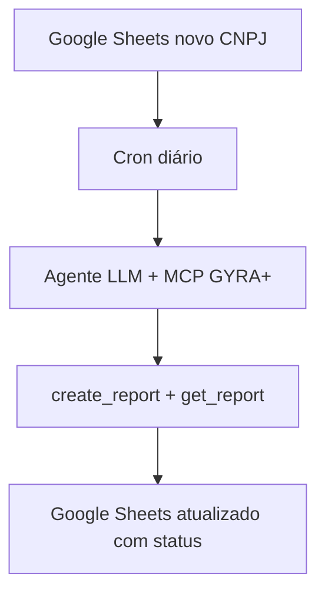

<Info>
  **Resumo:** esta página reúne cenários concretos de uso do MCP da GYRA+, com o prompt que o analista digita, o que o agente faz nos bastidores e a resposta esperada. Serve como inspiração para quem está começando e como referência para quem quer desenhar automações mais sofisticadas.
</Info>

## Caso 1, analista de crédito no chat

### Contexto

Analista recebeu o CNPJ de um possível cliente por WhatsApp e quer rodar a análise rápido, sem abrir o toolbox.

### Conversa

> **Analista**: Roda uma análise rápida no CNPJ 43.591.367/0001-30 com a política padrão PJ.
>
> **Agente**: Analisando... A análise foi concluída com status **APPROVED**.
>
> - Score bureau: 742 (acima do mínimo de 600 da política)
> - Sem protestos ativos
> - Sem PEFIN/REFIN
> - Faturamento estimado: R$ 1.8MM/ano
> - Precificação sugerida: R$ 80.000 em 24 meses a 1.99% a.m.
>
> Quer que eu gere o PDF ou o XLS para você compartilhar?
>
> **Analista**: Manda o PDF.
>
> **Agente**: PDF gerado, link válido por 7 dias: https://toolbox.gyramais.com.br/export/report/...

### Tools encadeadas

1. `list_policies(documentType: "PJ")` — achar a padrão.
2. `create_report(document, policyId)` — disparar.
3. `get_report(reportId)` — polling até completar.
4. `get_report_section_by_type(reportId, "SUMMARY")` — pegar o resumo.
5. `export_report_sync(reportId, exportFormat: "pdf")` — gerar PDF com link de 7 dias.

## Caso 2, monitoramento de carteira

### Contexto

Gestor de crédito quer saber, toda segunda de manhã, quais análises foram negadas na semana anterior e qual regra foi a que mais bloqueou.

### Conversa

> **Gestor**: Quantas análises fomos negar na semana passada e qual regra mais apareceu como motivo?
>
> **Agente**: Consultando...
>
> - **47 análises negadas** entre 15/04 e 21/04.
> - Regra mais frequente de bloqueio: **`Score bureau < 500`**, presente em 28 das 47 (59%).
> - Em segundo lugar: **`Situação cadastral INAPTA`**, em 9 análises (19%).
> - Tendência: aumento de 12% vs. semana anterior.
>
> Quer que eu detalhe por política ou por CNPJ?

### Tools encadeadas

1. `count_reports({ status: "DENIED", from, to })`.
2. `list_reports({ status: "DENIED", from, to, limit: 100 })`.
3. `get_report_section_by_type(...)` iterando para extrair regras bloqueantes.
4. Agregação e resposta.

## Caso 3, análise manual com justificativa

### Contexto

Relatório voltou `DENIED` pela política automática, mas o analista sabe que o cliente é histórico e decide aprovar manualmente com justificativa.

### Conversa

> **Analista**: Me traz o relatório 6612a7f3...
>
> **Agente**: O relatório foi **NEGADO** pela política (score bureau abaixo do mínimo). Quer que eu registre uma análise manual?
>
> **Analista**: Sim, aprova com a justificativa "cliente há 5 anos, sem inadimplência no histórico".
>
> **Agente**: Análise manual registrada, relatório agora consta como **APPROVED** com seu parecer anexado.

### Tools encadeadas

1. `get_report(reportId)` — revisa o status automático.
2. `analyze_report({ reportId, approved: true, commentary: "..." })` — registra decisão manual.

<Tip>
Se a decisão manual já tiver sido registrada e for necessário alterá-la, o agente usa `re_analyze_report` (exige permissão específica do usuário).
</Tip>

## Caso 4, onboarding self-service com agente

### Contexto

Fintech está construindo um onboarding via WhatsApp onde o próprio cliente final envia o CNPJ e o agente responde se ele é elegível.

### Conversa (cliente final)

> **Cliente**: Oi, quero abrir conta. CNPJ 12.345.678/0001-99.
>
> **Agente interno** (chama MCP): `create_report(document: "12345678000199", policyId: "<onboarding>")`, aguarda, lê breakdown.
>
> **Agente ao cliente**: Obrigado! Sua empresa foi **pré-aprovada** para abrir conta. Vou te enviar o link para finalizar...

### Considerações

- Em produção a orquestração é feita pelo backend da fintech, o MCP é um padrão conveniente se o stack já usa LLM.
- Para volume alto, chamar API REST diretamente é mais barato e previsível.

## Caso 5, auditor externo em due diligence

### Contexto

Auditoria independente precisa revisar 200 análises de crédito do último trimestre e gerar relatório consolidado.

### Conversa

> **Auditor**: Me traz todas as análises aprovadas no Q1 de 2026 com valor acima de R$ 500.000 e que usaram a política "Capital de Giro PJ".
>
> **Agente**: Encontrei 38 análises. Quer que eu traga o breakdown por seção para consolidar?
>
> **Auditor**: Sim, foco em concentração por CNAE e score médio.
>
> **Agente**: Consolidei os breakdowns. 3 CNAEs concentram 72% do volume aprovado: Comércio (34%), Serviços Empresariais (24%), Indústria Têxtil (14%). Score médio: 712, mediana: 698.

### Tools encadeadas

1. `list_reports({ status: "APPROVED", minAmount: 500000, policyId, from, to })`.
2. `get_report_section_by_type(...)` iterando para extrair CNAE e score.
3. Agregação e resposta.

## Caso 6, agente autônomo com cron

### Contexto

Worker que roda diariamente, lê CNPJs novos de uma planilha Google Sheets, passa pela GYRA+ e escreve o resultado de volta.

### Arquitetura

### Prompt do agente (em loop)

> Para cada linha no range `A2:A` onde a coluna B está vazia, extraia o CNPJ da coluna A, rode `create_report` com a política "Onboarding Básico PJ", aguarde o `COMPLETED` e escreva em B o status, em C o score, em D a precificação.

Funciona com Claude Code + MCP Sheets + MCP GYRA+ em paralelo. Ver [Instalação](/mcp/instalacao).

## Dicas para conversas produtivas

<CardGroup cols={2}>
  <Card title="Seja específico no contexto" icon="bullseye">
    "analisa com a política Capital de Giro Tier A" bate melhor que "roda uma análise".
  </Card>
  <Card title="Confirme antes de ações destrutivas" icon="shield-halved">
    "confirma antes de deletar webhooks" evita que o agente apague algo importante.
  </Card>
  <Card title="Peça o plano antes da execução" icon="list-check">
    "primeiro me diz o plano, depois execute" dá chance de revisar.
  </Card>
  <Card title="Use IDs quando disponíveis" icon="fingerprint">
    Se você já tem o `reportId`, colocar no prompt é mais rápido e evita ambiguidade.
  </Card>
</CardGroup>

## Limitações comuns

- **Modelos pequenos erram a escolha de tool** em casos ambíguos. Em produção, preferir Claude 3.5 Sonnet ou superior (ou GPT-4 class).
- **Encadeamento longo** (>20 tools seguidas) pode cortar contexto. Para auditoria grande, rode em batches menores.
- **Documentos formatados** (`43.591.367/0001-30`) funcionam, mas o agente costuma normalizar para `43591367000130` antes de chamar a API. Ambos são aceitos.

## Próximos passos

<CardGroup cols={2}>
  <Card title="Ferramentas disponíveis" icon="toolbox" href="/mcp/ferramentas-disponiveis">
    Catálogo completo.
  </Card>
  <Card title="Troubleshooting" icon="wrench" href="/mcp/troubleshooting">
    Quando o agente não faz o esperado.
  </Card>
  <Card title="Instalação" icon="download" href="/mcp/instalacao">
    Setup dos clientes MCP.
  </Card>
  <Card title="Webhooks" icon="webhook" href="/concepts/webhooks-e-tempo-real">
    Combinar MCP com eventos em tempo real.
  </Card>
</CardGroup>
