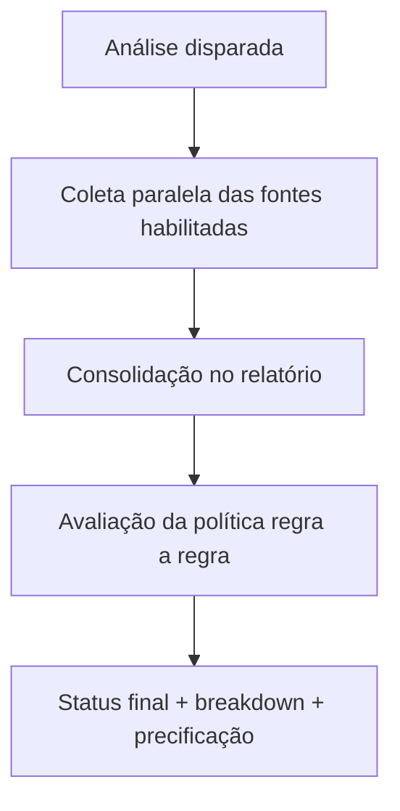

<Info>
  **Resumo:** o relatório GYRA+ é composto por **fontes independentes** (cadastral, bureau, processos, SCR, vínculos, etc.), orquestradas automaticamente em cada análise. Cada fonte tem custo, latência e nível de relatório exigido. Esta página é o mapa das fontes disponíveis e como escolher o nível certo.
</Info>

## Categorias

| Categoria | O que entrega | Exemplos de uso |
| --------- | ------------- | --------------- |
| **Cadastral** | Identidade oficial do documento | Bloqueio por situação irregular, idade mínima |
| **Bureau de Crédito** | Score de mercado + restritivos comerciais | Score mínimo, faixa de risco |
| **Processos Judiciais** | Ações como autor e réu | Risco trabalhista, tributário, cível |
| **Protestos** | Cartórios de protesto em todo o Brasil | Restritivo cartorial |
| **PEFIN / REFIN** | Restritivos comerciais ativos | Bloqueio por inadimplência ativa |
| **SCR / Open Finance** | Endividamento bancário real | Capacidade, concentração, atraso |
| **PEP e Sanções** | Exposição política e listas restritivas | Compliance, KYC, PLD |
| **Vínculos Societários** | QSA, sócios, filiais, grupo econômico | Análise de grupo, concentração |
| **Demográfica** | Endereço, idade, região | Segmentação, scoring auxiliar |
| **Financeira (PF)** | Indicadores de renda e perfil financeiro | Capacidade PF |
| **Veículos** | Propriedade de veículos (RENAVAM) | Patrimônio, colateral |
| **Mídia e Reputação** | Exposição em mídia, sinais online | Due diligence reputacional |
| **Benefícios Sociais** | Bolsa Família, BPC, Seguro Desemprego | Capacidade, segmentação PF |

Cada fonte tem página dedicada no menu lateral.

## Níveis de relatório

| Nível | Cobertura | Janela histórica | Latência típica |
| ----- | --------- | ----------------- | --------------- |
| **SIMPLES** | Cadastral, básico | Snapshot atual | 2 a 5 s |
| **ESSENCIAL** | + Bureau, Protestos, PEFIN/REFIN, Processos, Vínculos 1º nível | Desde 2014 (últimas movimentações) | 5 a 15 s |
| **COMPLETO** | + SCR (com consentimento), Mídia, Demografia, Benefícios | Desde 2014 (últimas movimentações) | 10 a 30 s |
| **COMPLETO+** | + Histórico estendido em todas as fontes | Desde 1990 | 15 a 45 s |

Nível é definido **na política**, não na chamada. Uma organização pode ter políticas em níveis diferentes para produtos diferentes.

## Como as fontes se combinam

Toda análise passa por duas fases:

1. **Coleta**: fontes são consultadas em **paralelo**. A latência total é dominada pela fonte mais lenta (tipicamente SCR via Open Finance).
2. **Avaliação**: cada regra da política puxa o campo da fonte relevante (ex: `creditBureauScoreSummary.score` puxa da fonte bureau).

Fonte indisponível no momento da consulta não bloqueia o relatório: o campo fica nulo e as regras que dependem dele são tratadas conforme o comportamento configurado (normalmente `ALERT`).

## Natureza dos dados

| Tipo | Exemplo | Consentimento exigido |
| ---- | ------- | --------------------- |
| **Público** | CNPJ na Receita, processos em tribunais | Não |
| **Semi-público** | Protestos em cartório | Não (agregador autorizado) |
| **Restrito LGPD (PF)** | Dados cadastrais de pessoa física | Consentimento de negócio |
| **Consentimento explícito** | SCR via Open Finance | Sim, Termo BCB |
| **Contratado** | Bureau (Serasa, Boa Vista, ProScore) | Sim, via contrato |

Cada página de fonte detalha a base legal específica.

## Custo e latência

Nem toda análise precisa ser completa. A recomendação geral:

<CardGroup cols={2}>
  <Card title="SIMPLES" icon="gauge-simple">
    Triagem inicial, pré-análise, onboarding leve. Baixo custo, alta velocidade.
  </Card>
  <Card title="ESSENCIAL" icon="gauge">
    Concessão de crédito pequeno ticket, cartão, antecipação de recebíveis pequena.
  </Card>
  <Card title="COMPLETO" icon="gauge-high">
    Concessão padrão, capital de giro, crédito PJ médio ticket.
  </Card>
  <Card title="COMPLETO+" icon="gauge-max">
    Análise profunda, crédito grande ticket, M&A, due diligence.
  </Card>
</CardGroup>

## Escolher fontes na política

No editor de política, painel lateral *Dados Consultados*. Ativa ou desativa cada fonte individualmente. Regra geral:

- **Ativar só o que você usa.** Cada fonte habilitada gera custo, mesmo que nenhuma regra consulte.
- **Regras órfãs são bloqueadas.** Se uma regra usa SCR e SCR está desativado, o editor bloqueia o salvar.
- **Janelas configuráveis.** Processos (12, 24, 60 meses), SCR (meses de histórico), vínculos (profundidade).

Detalhes em [Criar Política](/toolbox/criar-politica) e [Editar Política](/toolbox/editar-politica).

## Perguntas frequentes

<AccordionGroup>
  <Accordion title="Posso ter níveis diferentes em políticas diferentes?">
    Sim. Uma organização tipicamente tem políticas SIMPLES para triagem, ESSENCIAL para pequeno ticket e COMPLETO para concessão. A escolha é por política, não por organização.
  </Accordion>
  <Accordion title="Uma fonte ficou lenta, posso aumentar o timeout?">
    Timeouts são gerenciados pela GYRA+ e calibrados por fonte. Se uma fonte falha por timeout, o campo volta nulo e o relatório completa com `ALERT` ou `ERROR` dependendo da configuração. A reanálise depois costuma resolver.
  </Accordion>
  <Accordion title="Por que o campo X veio nulo?">
    Três razões possíveis: (1) fonte não foi habilitada na política; (2) fonte foi habilitada mas falhou na consulta; (3) documento não tem o dado (ex: CPF sem histórico de SCR).
  </Accordion>
  <Accordion title="Tem como ver quanto cada fonte custou?">
    Sim. Em *Configurações, Faturamento*, há breakdown por fonte e por análise. Lotes mostram custo agregado.
  </Accordion>
  <Accordion title="E fontes que eu tenho contrato próprio?">
    Hoje o BYOC (bring your own credential) é suportado para Serasa. Outras fontes consumimos pelo contrato agregado da GYRA+.
  </Accordion>
</AccordionGroup>

## Próximos passos

<CardGroup cols={2}>
  <Card title="Cadastral" icon="id-card" href="/sources/cadastral">
    Ponto de partida de qualquer análise.
  </Card>
  <Card title="Bureau de Crédito" icon="chart-line" href="/sources/bureau-credito">
    Score e restritivos comerciais.
  </Card>
  <Card title="SCR / Open Finance" icon="building-columns" href="/sources/scr-open-finance">
    Endividamento bancário real.
  </Card>
  <Card title="Relatório (conceito)" icon="file-lines" href="/concepts/relatorio">
    Como o relatório se monta.
  </Card>
</CardGroup>
