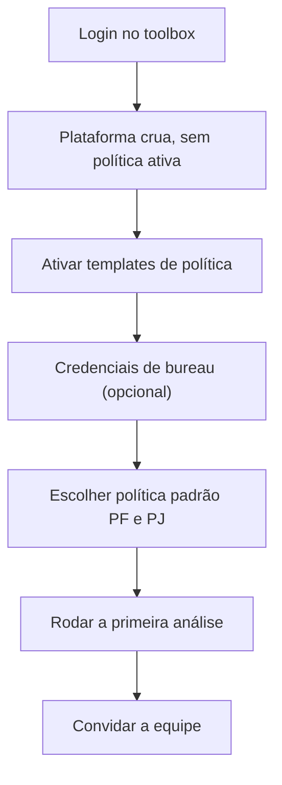

<Info>
  **Resumo:** a GYRA+ é entregue **crua**, sem nenhuma política ativa. O administrador ou gestor de crédito precisa escolher quais templates de política serão disponibilizados para o time antes que qualquer usuário consiga rodar uma operação. Esta página é o roteiro do zero até a primeira operação aprovada.
</Info>

## Pré-requisitos

- **Convite ativo** no toolbox (chegou por e-mail do `noreply@gyramais.com.br`).
- **Papel de administrador ou gestor de crédito** para executar a configuração de templates e políticas. Usuários analistas só dependem do passo 5 em diante.
- **Navegador atualizado** (Chrome, Firefox, Edge ou Safari, versões recentes).

## Fluxo completo

<Steps>
  <Step title="Fazer login no toolbox">
    Acesse [toolbox.gyramais.com.br](https://toolbox.gyramais.com.br/login).

    Formas de autenticar:

    - **E-mail e senha**, com 2FA opcional configurável no perfil.
    - **SSO Google**, para organizações que usam Google Workspace.
    - **SSO Microsoft Azure AD**, para organizações que usam Entra ID.

    No primeiro login o sistema pede a confirmação de e-mail e a configuração de senha definitiva.
  </Step>
  <Step title="Entender o estado inicial: plataforma crua">
    Logo após o primeiro login você verá o toolbox **sem nenhuma política ativa**. Isso é intencional: política de crédito é uma decisão de negócio e a GYRA+ não assume qual é a sua.

    **Consequência prática:** enquanto o administrador ou gestor de crédito não ativar pelo menos um template, nenhum usuário consegue rodar uma operação. Ao digitar um CPF ou CNPJ, a lista de políticas disponíveis aparece vazia.
  </Step>
  <Step title="Ativar templates de política">
    Na seção **Política de Crédito, Templates** há um catálogo de templates prontos (Antecipação de Recebíveis, Crédito PJ Premium, Cartão PF, Capital de Giro, KYC, entre outros). Ver o catálogo completo em [Templates de Política](/concepts/templates-de-politica).

    Duas formas de trazer um template para a sua organização:

    - **Ativar o template direto.** Útil quando as regras padrão do template já atendem. A política fica disponível exatamente como o template foi definido.
    - **Criar uma política a partir do template, customizar e salvar.** Útil quando você quer ajustar thresholds, adicionar regras específicas ou mudar a mensagem. Abrir o template, clicar em *Criar política a partir deste template*, customizar regras/fórmulas, salvar com o nome que quiser e habilitar.

    **O passo final, independente da opção escolhida, é habilitar a política** (toggle *Habilitada* no cabeçalho da política). Política salva mas desabilitada não aparece no menu de operação.

    Passo a passo visual em [Usar Templates](/toolbox/usar-templates). Para customização granular, ver [Criar Política](/toolbox/criar-politica) e [Editar Política](/toolbox/editar-politica).
  </Step>
  <Step title="Configurar credenciais próprias de bureau, opcional">
    Se a sua organização já tem contrato direto com o Serasa, configure a credencial em *Configurações, Integrações* para consumir o bureau pelo seu contrato (BYOC). Detalhes e como solicitar credenciais de produção no Serasa em [Bureau de Crédito](/sources/bureau-credito).

    Boa Vista e ProScore são consumidos pelo contrato agregado da GYRA+, sem configuração adicional.
  </Step>
  <Step title="Escolher política padrão PF e PJ">
    A política padrão é definida **diretamente no dropdown** que abre quando você digita um CPF ou CNPJ no input de análise (sempre visível no topo do toolbox). No próprio dropdown, ao lado de cada política, há a ação *tornar padrão*. Uma política padrão por tipo de documento por usuário.

    Com o padrão marcado, ao digitar um CPF ou CNPJ o toolbox já pré-seleciona a política correspondente, economizando um clique por análise. Sem padrão, o dropdown lista todas as políticas ativas compatíveis com o tipo de documento e você escolhe manualmente.

    Regra que vale sempre: ao digitar um CPF, só aparecem políticas PF; ao digitar um CNPJ, só aparecem políticas PJ. A filtragem por tipo de documento é automática.
  </Step>
  <Step title="Rodar a primeira análise">
    No topo do toolbox fica o **input sempre visível** de análise. Basta digitar o CPF ou CNPJ, que o sistema:

    1. Identifica o tipo de documento.
    2. Abre o dropdown com as políticas (e operações, se houver) disponíveis para aquele tipo, ou com a política padrão já selecionada.
    3. Ao apertar **Enter**, dispara o processamento e redireciona para a tela do relatório.

    Em segundos, o resultado aparece com status (`APPROVED`, `ALERT`, `DENIED`), breakdown das regras e, se a política tiver fórmulas, a precificação. Detalhes em [Rodar uma Análise](/toolbox/rodar-operacao) e [Interpretar Resultado](/toolbox/interpretar-resultado-operacao).
  </Step>
  <Step title="Convidar a equipe">
    Em *Configurações, Usuários*, convide analistas, gestores e outros administradores. Cada usuário recebe um e-mail com link de convite e configura o próprio acesso.

    Papéis e permissões em [Gerenciar Usuários e Permissões](/toolbox/gerenciar-usuarios-permissoes).
  </Step>
</Steps>

## Checklist rápido

<CardGroup cols={2}>
  <Card title="1. Login" icon="right-to-bracket">
    E-mail e senha, SSO Google ou SSO Azure AD.
  </Card>
  <Card title="2. Ativar templates" icon="sparkles" href="/toolbox/usar-templates">
    Ao menos uma política PF e uma PJ habilitadas.
  </Card>
  <Card title="3. Credencial de bureau (opcional)" icon="key" href="/sources/bureau-credito">
    BYOC Serasa, se aplicável.
  </Card>
  <Card title="4. Política padrão por usuário" icon="user-gear">
    Marcar no dropdown do input ao digitar um documento.
  </Card>
  <Card title="5. Primeira análise" icon="play" href="/toolbox/rodar-operacao">
    Digitar o documento no input e rodar.
  </Card>
  <Card title="6. Convidar equipe" icon="users" href="/toolbox/gerenciar-usuarios-permissoes">
    Analistas, gestores, admins.
  </Card>
</CardGroup>

## Perguntas frequentes

<AccordionGroup>
  <Accordion title="Por que a plataforma vem sem política ativa?">
    Política de crédito é decisão de negócio e varia muito entre segmentos (fintech, distribuidora, factoring, varejo). Entregar com política default poderia levar a decisões inadequadas. A GYRA+ oferece templates prontos como ponto de partida, mas a ativação é sempre consciente do gestor.
  </Accordion>
  <Accordion title="Quem pode ativar templates?">
    Apenas administradores e gestores de crédito têm permissão para habilitar/desabilitar políticas. Analistas só podem rodar análises sobre políticas já ativas.
  </Accordion>
  <Accordion title="Posso ter várias políticas PF e várias PJ ativas ao mesmo tempo?">
    Sim. É comum ter uma política por produto (Capital de Giro, Antecipação, Cartão) e o analista seleciona qual usar no dropdown ao digitar o documento. A política padrão é só uma sugestão automática, o usuário sempre pode trocar antes de apertar Enter.
  </Accordion>
  <Accordion title="O que é o menu *Operações* então?">
    É uma **feature opcional** para casos mais complexos, onde você configura cadeias de políticas que rodam automaticamente a partir dos relacionamentos encontrados no CPF/CNPJ (sócios, filiais, parentes). Detalhes em [Operações](/concepts/operacoes). Para análise simples, basta o input no topo do toolbox.
  </Accordion>
  <Accordion title="Como faço se um template não atende?">
    Use a opção *Criar política a partir deste template* para clonar e customizar. Se precisar começar do zero, veja [Criar Política](/toolbox/criar-politica).
  </Accordion>
  <Accordion title="Perdi meu convite, o que fazer?">
    Peça ao administrador da sua organização que reenvie pelo toolbox em *Configurações, Usuários, reenviar convite*. Se não souber quem é o administrador, fale com o suporte da GYRA+.
  </Accordion>
</AccordionGroup>

## Próximos passos

<CardGroup cols={2}>
  <Card title="Visão Geral do Toolbox" icon="compass" href="/toolbox/visao-geral">
    Tour pelas seções principais da plataforma.
  </Card>
  <Card title="Usar Templates" icon="sparkles" href="/toolbox/usar-templates">
    Catálogo completo e ativação passo a passo.
  </Card>
  <Card title="Criar Política" icon="wand-magic-sparkles" href="/toolbox/criar-politica">
    Do zero ou a partir de um template.
  </Card>
  <Card title="Rodar Operação" icon="play" href="/toolbox/rodar-operacao">
    Primeira análise ponta a ponta.
  </Card>
</CardGroup>
