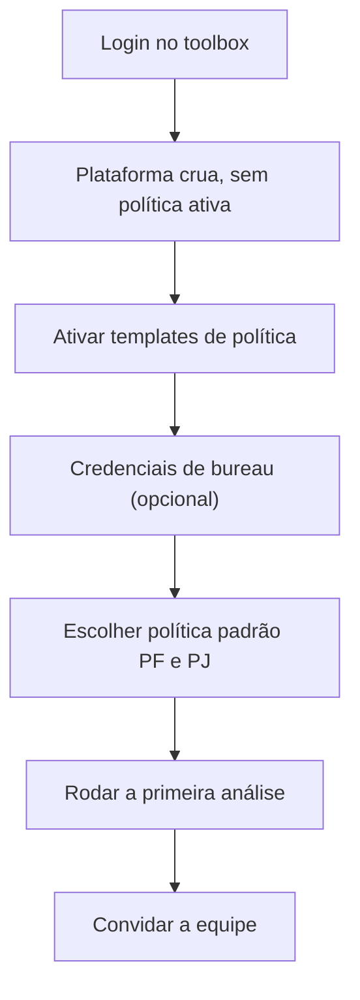

<Info>
  **Resumo:** a GYRA+ é entregue **crua**, sem nenhuma política ativa. O administrador ou gestor de crédito precisa escolher quais templates de política serão disponibilizados para o time antes que qualquer usuário consiga rodar uma análise. Esta página é o roteiro do zero até a primeira análise aprovada. Dentro do Toolbox, o mesmo roteiro aparece como **Primeiros passos**, no [Início](/toolbox/inicio) e no rodapé do menu.
</Info>

## Primeiros passos dentro do Toolbox

Organizações novas recebem a lista **Primeiros passos** no rodapé do menu lateral, com o progresso (por exemplo, 2/5). Cada passo leva à tela certa, abre uma escolha ou chama o [Assistente GYRA+](/plataforma/assistente-gyra). A lista padrão traz:

| Passo | Para quem |
| --- | --- |
| **Convide sua equipe** | Quem gerencia usuários |
| **Personalize sua marca** | Quem gerencia configurações |
| **Configure sua análise de crédito**: **Montar com a GYRA+**, **Usar um modelo pronto** ou **Montar uma esteira completa** | Quem monta política |
| **Defina como receber propostas**: formulário de proposta, formulário de cadastro ou integração por API | Conforme os módulos e o acesso |
| **Faça sua primeira análise** | Quem acessa **Análises** |

Os passos que você vê dependem do seu papel e dos módulos da organização. Um passo que levaria a uma tela que você não acessa não aparece.

No [Início](/toolbox/inicio), durante os **30 primeiros dias** da organização, até dois passos pendentes viram sugestão debaixo da barra. Passo feito por fora também conta: política criada na tela de Políticas ou análise rodada pela barra. Enquanto não há política nem esteira para rodar, quem monta política vê no Início o cartão **Sua análise de crédito ainda não está configurada**, com as opções para começar.

## Vídeo tutorial

<Frame caption="Walkthrough do primeiro acesso no Toolbox">
  <iframe
    width="100%"
    height="420"
    src="https://www.youtube.com/embed/6UC9TDZxb3w"
    title="Primeiro acesso no Toolbox GYRA+"
    frameborder="0"
    allow="accelerometer; autoplay; clipboard-write; encrypted-media; gyroscope; picture-in-picture"
    allowfullscreen
  ></iframe>
</Frame>

## Pré-requisitos

- **Convite ativo** no toolbox (chegou por e-mail do `cadastro@gyramais.com`).
- **Papel de administrador ou gestor de crédito** para executar a configuração de templates e políticas. Usuários analistas só dependem do passo 5 em diante.
- **Navegador atualizado** (Chrome, Firefox, Edge ou Safari, versões recentes).

## Fluxo completo

```mermaid
flowchart TD
  A["Login no toolbox"] --> B["Plataforma crua, sem política ativa"]
  B --> C["Ativar templates de política"]
  C --> D["Credenciais de bureau (opcional)"]
  D --> E["Escolher política padrão PF e PJ"]
  E --> F["Rodar a primeira análise"]
  F --> G["Convidar a equipe"]
```

<Steps>
  <Step title="Fazer login no toolbox">
    Acesse [toolbox.gyramais.com.br](https://toolbox.gyramais.com.br/login).

    Formas de autenticar:

    - **E-mail e senha**.
    - **SSO Google**, para organizações que usam Google Workspace.
    - **SSO Microsoft Azure AD**, para organizações que usam Entra ID.

    No primeiro acesso, um e-mail é enviado para o endereço cadastrado contendo o link para criação da senha. Após definir a senha, o usuário acessa diretamente o toolbox.
  </Step>
  <Step title="Entender o estado inicial: plataforma crua">
    Logo após o primeiro login você verá o toolbox **sem nenhuma política ativa**. Isso é intencional: política de crédito é uma decisão de negócio e a GYRA+ não assume qual é a sua.

    **Consequência prática:** enquanto o administrador ou gestor de crédito não ativar pelo menos um template, nenhum usuário consegue rodar uma análise. Ao digitar um CPF ou CNPJ, a lista de políticas disponíveis aparece vazia, e o Início mostra o cartão **Sua análise de crédito ainda não está configurada** para quem monta política.
  </Step>
  <Step title="Ativar templates de política">
    Em **Motor de crédito**, **Políticas**, aba **Templates**, há um catálogo de templates prontos (Antecipação de Recebíveis, Crédito PJ Premium, Cartão PF, Capital de Giro, KYC, entre outros). Ver o catálogo completo em [Templates de Política](/concepts/templates-de-politica).

    Duas formas de trazer um template para a sua organização (ou, em vez de template, peça ao [Assistente GYRA+](/plataforma/assistente-gyra) com **Montar com a GYRA+**: ele faz as perguntas e monta a política com você, com prévia antes de gravar):

    - **Ativar o template direto**, pela chave no cartão do template. Útil quando as regras padrão do template já atendem. A política fica disponível exatamente como o template foi definido.
    - **Criar uma política a partir do template, customizar e salvar.** Útil quando você quer ajustar thresholds, adicionar regras específicas ou mudar a mensagem. Abrir o template, clicar em **Criar a partir deste template**, customizar regras/fórmulas, salvar com o nome que quiser e habilitar.

    **O passo final, independente da opção escolhida, é ativar a política** (a etiqueta no cabeçalho da política passa de **Inativa** para **Ativa**). Política salva mas inativa não aparece na lista da barra de análise.

    Passo a passo visual em [Usar Templates](/toolbox/usar-templates). Para customização granular, ver [Criar Política](/toolbox/criar-politica) e [Editar Política](/toolbox/editar-politica).
  </Step>
  <Step title="Configurar credenciais próprias de bureau, opcional">
    Se a sua organização já tem contrato direto com o Serasa, configure a credencial em **Configurações**, aba **Fontes de dados** (pelo menu da organização, no logo do topo do menu lateral), para consumir o bureau pelo seu contrato (BYOC). Detalhes e como solicitar credenciais de produção no Serasa em [Bureau de Crédito](/sources/bureau-credito).

    Boa Vista e ProScore são consumidos pelo contrato agregado da GYRA+, sem configuração adicional.
  </Step>
  <Step title="Escolher política padrão PF e PJ">
    A política padrão é definida **no cartão do documento**, que abre quando você digita um CPF ou CNPJ na barra (no topo de todas as telas e no centro do Início). Escolha em **Política ou esteira** e ligue a chave **Definir como padrão**, logo abaixo. Uma padrão por tipo de documento por usuário.

    Com o padrão marcado, ao digitar um CPF ou CNPJ o toolbox já pré-seleciona a política correspondente, economizando um clique por análise. Sem padrão, a lista abre sozinha com as políticas e esteiras ativas compatíveis com o tipo de documento, e você escolhe. No celular, a escolha é feita no seletor do próprio aparelho.

    Regra que vale sempre: ao digitar um CPF, só aparecem políticas e esteiras de CPF; ao digitar um CNPJ, só as de CNPJ. A filtragem por tipo de documento é automática.
  </Step>
  <Step title="Rodar a primeira análise">
    No centro do Início (e no topo das outras telas) fica a **barra**. Basta digitar o CPF ou CNPJ, que o sistema:

    1. Identifica o tipo de documento.
    2. Abre o cartão do documento com as políticas e as [esteiras](/esteiras/visao-geral) ativas para aquele tipo, ou com a padrão já selecionada.
    3. Ao apertar **Enter**, dispara o processamento e redireciona para a tela do relatório.

    O passo **Faça sua primeira análise**, dos Primeiros passos, leva o cursor direto para a barra.

    Em segundos, o resultado aparece com status (`APPROVED`, `ALERT`, `DENIED`), breakdown das regras e, se a política tiver fórmulas, a precificação. Detalhes em [Rodar uma Análise](/toolbox/rodar-operacao) e [Interpretar Resultado do Relatório](/toolbox/interpretar-resultado-operacao).
  </Step>
  <Step title="Convidar a equipe">
    No menu da organização (logo no topo do menu lateral), em **Usuários e permissões**, convide analistas, gestores e outros administradores. Cada usuário recebe um e-mail com link de convite e configura o próprio acesso.

    Papéis e permissões em [Gerenciar Usuários e Permissões](/toolbox/gerenciar-usuarios-permissoes).
  </Step>
</Steps>

## Checklist rápido

<CardGroup cols={2}>
  <Card title="1. Login" icon="right-to-bracket">
    E-mail e senha, SSO Google ou SSO Azure AD.
  </Card>
  <Card title="2. Ativar templates" icon="sparkles" href="/toolbox/usar-templates">
    Ao menos uma política PF e uma PJ habilitadas.
  </Card>
  <Card title="3. Credencial de bureau (opcional)" icon="key" href="/sources/bureau-credito">
    BYOC Serasa, se aplicável.
  </Card>
  <Card title="4. Política padrão por usuário" icon="user-gear">
    **Definir como padrão**, no cartão do documento.
  </Card>
  <Card title="5. Primeira análise" icon="play" href="/toolbox/rodar-operacao">
    Digitar o documento na barra e rodar.
  </Card>
  <Card title="6. Convidar equipe" icon="users" href="/toolbox/gerenciar-usuarios-permissoes">
    Analistas, gestores, admins.
  </Card>
</CardGroup>

## Perguntas frequentes

<AccordionGroup>
  <Accordion title="Por que a plataforma vem sem política ativa?">
    Política de crédito é decisão de negócio e varia muito entre segmentos (fintech, distribuidora, factoring, varejo). Entregar com política default poderia levar a decisões inadequadas. A GYRA+ oferece templates prontos como ponto de partida, mas a ativação é sempre consciente do gestor.
  </Accordion>
  <Accordion title="Quem pode ativar templates?">
    Apenas administradores e gestores de crédito têm permissão para habilitar e desabilitar políticas. Analistas só podem rodar análises sobre políticas já ativas.
  </Accordion>
  <Accordion title="Posso ter várias políticas PF e várias PJ ativas ao mesmo tempo?">
    Sim. É comum ter uma política por produto (Capital de Giro, Antecipação, Cartão) e o analista seleciona qual usar no cartão do documento, ao digitá-lo na barra. A política padrão é só uma sugestão automática, o usuário sempre pode trocar antes de apertar Enter.
  </Accordion>
  <Accordion title="E as esteiras, preciso delas?">
    Não para começar. Esteira é um fluxo com etapas (camadas de análise, documentos do cliente, alçada, contrato) que usa suas políticas no caminho, e fica em **Motor de crédito**, **Esteiras**. Para análise simples, basta a barra do topo. Ver [Esteiras](/esteiras/visao-geral) e [Montar uma esteira](/toolbox/montar-esteira).
  </Accordion>
  <Accordion title="Como faço se um template não atende?">
    Use **Criar a partir deste template** para clonar e customizar. Se precisar começar do zero, veja [Criar Política](/toolbox/criar-politica).
  </Accordion>
  <Accordion title="Não vejo os Primeiros passos no menu.">
    A lista aparece para organizações novas. Ela também some quando você a oculta (para trazer de volta, use **Mostrar primeiros passos**, na área de ajuda do menu), quando o time GYRA+ a desliga para a sua organização ou uma semana depois de todos os passos concluídos.
  </Accordion>
  <Accordion title="Perdi meu convite, o que fazer?">
    Peça ao administrador da sua organização que reenvie pelo toolbox, em **Usuários e permissões** (menu da organização). Se não souber quem é o administrador, fale com o suporte da GYRA+.
  </Accordion>
</AccordionGroup>

## Próximos passos

<CardGroup cols={2}>
  <Card title="Visão Geral do Toolbox" icon="compass" href="/toolbox/visao-geral">
    Tour pelas seções principais da plataforma.
  </Card>
  <Card title="Usar Templates" icon="sparkles" href="/toolbox/usar-templates">
    Catálogo completo e ativação passo a passo.
  </Card>
  <Card title="Criar Política" icon="wand-magic-sparkles" href="/toolbox/criar-politica">
    Do zero ou a partir de um template.
  </Card>
  <Card title="Rodar uma análise" icon="play" href="/toolbox/rodar-operacao">
    Primeira análise ponta a ponta.
  </Card>
</CardGroup>
