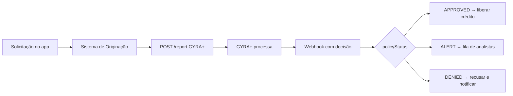

## Cenário

Uma fintech que oferece crédito pessoal ou capital de giro para empresas precisa:
- Analisar automaticamente cada solicitação
- Aprovar, alertar ou negar em menos de 2 minutos
- Manter rastreabilidade de cada decisão
- Integrar com seu sistema de originação existente

---

## Arquitetura recomendada



---

## Passo a passo

### 1. Definir a política de crédito

Configure uma política que avalie os critérios do seu produto. Para crédito pessoal (CPF), um exemplo:

| Grupo | Regra | Critério | Resultado |
|-------|-------|----------|-----------|
| Cadastral | `AGE_PERSON` | >= 21 anos | APPROVED |
| Cadastral | `DEATH` | IS_FALSE | DENIED se óbito |
| Score | `SCORE` | >= 500 | APPROVED |
| Score | `SCORE` | BETWEEN 300–499 | ALERT |
| Score | `SCORE` | < 300 | DENIED |
| Dívidas | `PEFIN_AMOUNT` | = 0 | APPROVED |
| Dívidas | `PEFIN_AMOUNT` | BETWEEN 1–3 | ALERT |
| Dívidas | `TOTAL_DEBT` | < R$ 5.000 | APPROVED |

Para capital de giro (CNPJ), adicione:

| Grupo | Regra | Critério | Resultado |
|-------|-------|----------|-----------|
| Cadastral | `COMPANY_OPENING_TIME` | >= 12 meses | APPROVED |
| Cadastral | `COMPANY_SITUATION` | = "Ativa" | APPROVED |
| Cadastral | `BANKRUPT` | IS_FALSE | DENIED |
| SCR | `SCR_TOTAL_LOSSES` | = 0 | APPROVED |
| SCR | `SCR_CALCULATED_REVENUE_EXPIRED` | < 5% | APPROVED |

### 2. Integrar o fluxo de solicitação

Quando uma solicitação chega no seu sistema de originação:

```javascript
// No seu backend — quando solicitação é recebida
async function processarSolicitacao(solicitacao) {
  const report = await gyraApi.post('/report', {
    document: solicitacao.cpfOuCnpj,
    type: solicitacao.tipo,          // 'CPF' ou 'CNPJ'
    policyId: POLICY_ID,
    externalId: solicitacao.id,      // ID da solicitação no seu sistema
  });

  // Salvar reportId para rastreabilidade
  await db.solicitacoes.update(solicitacao.id, {
    gyraReportId: report.id,
    status: 'analise_em_andamento',
  });
}
```

### 3. Processar a decisão via webhook

```javascript
// Endpoint que recebe o webhook da GYRA+
app.post('/webhooks/gyra', async (req, res) => {
  res.sendStatus(200); // Responder antes de processar

  const { reportId, policyStatus, score, externalId } = req.body;

  const solicitacao = await db.solicitacoes.findByExternalId(externalId);

  if (policyStatus === 'APPROVED') {
    await aprovarCredito(solicitacao.id);
    await notificarCliente(solicitacao, 'aprovado');

  } else if (policyStatus === 'ALERT') {
    await enviarParaAnalistas(solicitacao.id, reportId);
    await notificarCliente(solicitacao, 'em_analise');

  } else if (policyStatus === 'DENIED') {
    await recusarCredito(solicitacao.id);
    await notificarCliente(solicitacao, 'negado');
  }
});
```

---

## Métricas que você pode monitorar

Com a rastreabilidade do `externalId` e `reportId`, você consegue acompanhar:

- **Taxa de aprovação automática** por período e produto
- **Tempo médio de análise** (do POST ao webhook)
- **Distribuição de score** da base de solicitantes
- **Principais motivos de negação** (quais regras são mais acionadas)
- **Taxa de ALERT convertidos** após revisão manual

---

## Boas práticas para fintechs

<Note>
Guarde o `reportId` de cada decisão. Em casos de contestação ou auditoria regulatória, o relatório completo fica disponível na GYRA+ e pode ser acessado a qualquer momento via `GET /report/:id`.
</Note>

- Configure **Risk Bands** com pelo menos 3 faixas: aprovação automática, alerta para revisão, negação
- Defina um **SLA claro** para tratamento manual dos casos `ALERT`
- Use o **score** (não só o status) para definir o valor do limite de crédito aprovado
- Implemente **logging** de todas as chamadas e webhooks para auditoria
